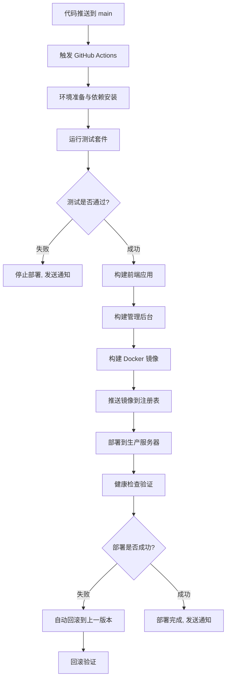

# 日新智链平台

北京工业大学校园学习交流微信小程序

## 项目简介

日新智链平台是一个专为北京工业大学师生设计的校园学习交流微信小程序，致力于打造"以学习者为中心"的智能化校园学习社区。平台通过整合分散的校园信息资源，提供一站式的学习、交流、成长服务，促进知识共享和协作学习。

## 核心功能

### 🔐 用户管理

- **用户认证**: 注册登录和微信快捷登录
- **角色系统**: 支持普通用户(user)和管理员(admin)两种角色
- **个人信息**: 头像、昵称、简介等信息管理
- **社交功能**: 关注/粉丝系统，用户互动
- **内容管理**: 个人发布的资源、帖子管理
- **收藏功能**: 资源和帖子收藏管理
- **权限控制**: 基于角色的访问控制系统

### 📚 学习资源模块

#### 核心功能

- **资源浏览**: 支持分类筛选和搜索
- **资源发布**: 带审核流程的资源发布系统
- **资源下载**: 安全的文件下载功能
- **资源收藏**: 个人收藏管理
- **资源评价**: 5 星评分系统和用户评论
- **资源分享**: 社交分享功能

#### 筛选功能

- **分类选择**: 课件、作业、实验、考试、项目、论文
- **实时搜索**: 支持标题和描述内容搜索
- **排序功能**: 支持按时间、下载量、评分等排序

#### 数据结构

- **分类系统**: 数据库驱动的分类管理
- **审核流程**: 发布 → 待审核 → 已发布/已拒绝
- **关联管理**: 资源-分类一对多关联

### 💬 论坛交流

- **帖子发布**: 支持富文本内容编辑
- **评论回复**: 多层级评论系统
- **标签分类**: 灵活的标签管理
- **内容点赞**: 用户互动机制
- **热门排序**: 按评论数、点赞数排序

### 📢 通知消息

- **系统通知**: 重要公告和系统消息
- **通知分类**: 系统、学习、互动、资源、公告等类型
- **消息管理**: 已读/未读状态、批量操作
- **优先级**: 高、中、低优先级管理
- **过期清理**: 自动清理过期通知

### 📖 学习管理

#### 学习计划功能

- **计划创建**: 可视化弹窗创建学习计划
- **计划编辑**: 支持计划信息修改和删除
- **计划切换**: 多计划管理和快速切换
- **进度跟踪**: 实时显示学习进度和完成率

#### 任务管理功能

- **任务创建**: 弹窗式任务创建界面
- **任务分类**: 支持优先级和截止时间设置
- **子任务支持**: 任务分解和子任务管理
- **状态管理**: 完成/未完成状态切换

#### 学习统计

- **进度可视化**: 图表展示学习时长和进度
- **数据统计**: 周/月/年度学习数据分析
- **任务完成度**: 任务完成情况统计

### 🛡️ 管理员系统

#### 核心功能

- **管理面板**: 系统概览、数据统计、待处理事项
- **用户管理**: 用户查看、状态管理、权限控制
- **内容审核**: 资源审核、帖子管理、评论监管
- **通知管理**: 系统通知发布、公告管理
- **数据统计**: 用户活跃度、内容统计、系统使用情况
- **系统监控**: 服务状态监控、操作日志记录

#### 访问方式

- **管理后台**: `domain.com/admin` Web端管理界面
- **权限验证**: 基于用户角色的访问控制
- **安全保障**: 独立的管理员认证和操作审计

## 技术架构

### 前端技术栈

#### 用户端（小程序）
- **框架**: uni-app (Vue.js 2.x) + TypeScript
- **UI 组件**: uni-ui + 自定义组件
- **样式**: SCSS + 响应式设计
- **状态管理**: Vue 响应式数据
- **路由**: uni-app 内置路由 + TabBar 导航
- **目标平台**: H5、微信小程序、App

#### 管理端（Web后台）
- **框架**: Vue 3 + TypeScript
- **UI 组件**: Element Plus
- **状态管理**: Pinia
- **路由**: Vue Router 4
- **HTTP**: Axios
- **构建工具**: Vite

### 后端技术栈

- **运行时**: Node.js 18+
- **框架**: Express.js
- **ORM**: Sequelize
- **数据库**: MySQL 8.0
- **缓存**: Redis 7
- **认证**: JWT + 基于角色的访问控制(RBAC)
- **权限**: 用户角色管理(user/admin)
- **测试**: Jest + Supertest

### 开发工具

- **IDE**: HBuilderX / 微信开发者工具
- **版本控制**: Git
- **包管理**: npm

## 部署架构

### 容器化部署架构

本项目采用基于 Docker 的微服务容器化部署架构，实现了前后端分离和服务解耦。

#### 架构图

```
Internet (HTTPS/HTTP)
        ↓
   Cloudflare CDN
        ↓
┌─────────────────────────────┐
│     Nginx 主代理服务        │  ← 端口 80/443
│   - 请求路由分发            │
│   - SSL 终端               │
│   - 静态文件缓存            │
│   - 负载均衡               │
└─────────────┬───────────────┘
              │
    ┌─────────┴─────────┐
    │                   │
    ▼                   ▼
┌─────────────┐   ┌─────────────┐
│ Frontend    │   │ Admin       │
│ Container   │   │ Container   │
│ (Nginx)     │   │ (Nginx)     │
│ 端口: 80    │   │ 端口: 80    │
└─────────────┘   └─────────────┘
              │
              ▼
    ┌─────────────────┐
    │ Backend         │
    │ Container       │
    │ (Node.js)       │
    │ 端口: 3000      │
    └─────────┬───────┘
              │
    ┌─────────┴─────────┐
    │                   │
    ▼                   ▼
┌─────────────┐   ┌─────────────┐
│ MySQL       │   │ Redis       │
│ Container   │   │ Container   │
│ 端口: 3306  │   │ 端口: 6379  │
└─────────────┘   └─────────────┘
```

#### 请求路由规则

```
用户请求路由分发:
├── https://domain.com/admin/*    → Admin Container (管理后台)
├── https://domain.com/api/*      → Backend Container (API服务)
├── https://domain.com/uploads/*  → 静态文件服务
├── https://domain.com/health     → 健康检查
└── https://domain.com/*          → Frontend Container (用户端)
```

#### 容器职责划分

| 容器名称 | 基础镜像 | 端口 | 职责 | 健康检查 |
|---------|---------|------|------|----------|
| **nginx** | nginx:alpine | 80/443 | 主代理、路由分发、SSL终端 | `/health` |
| **frontend** | nginx:alpine | 80 | 用户端静态文件服务 | `wget http://localhost/` |
| **admin-frontend** | nginx:alpine | 80 | 管理后台静态文件服务 | `wget http://localhost/health` |
| **backend** | node:18-alpine | 3000 | API服务、业务逻辑 | `http://localhost:3000/api/v1/health` |
| **mysql** | mysql:8.0 | 3306 | 数据持久化 | `mysqladmin ping` |
| **redis** | redis:7-alpine | 6379 | 缓存、会话存储 | `redis-cli ping` |

### CI/CD 部署流程

#### GitHub Actions 自动化部署



#### 部署阶段详细说明

1. **测试阶段** (test)
   - 环境: Ubuntu Latest + MySQL 8.0 + Redis 7
   - 执行单元测试和集成测试
   - 代码质量检查 (ESLint)

2. **构建阶段** (build) 
   - 并行构建用户前端和管理后台
   - 生成生产优化的静态文件
   - 上传构建产物作为 artifact

3. **Docker 镜像构建** (docker-build)
   - 多阶段构建优化镜像大小
   - 使用 GitHub Container Registry
   - 镜像缓存加速构建过程

4. **生产部署** (deploy)
   - 备份当前运行版本
   - 使用 Git 拉取最新代码
   - Docker Compose 重新构建和启动
   - 综合健康检查验证

5. **回滚机制** (rollback)
   - 自动检测部署失败
   - 回滚到最近的可用备份版本
   - 确保服务可用性

### 项目结构

```
wechat_software/
├── frontend/               # uni-app前端应用
│   ├── src/               # 前端源码
│   │   ├── pages/        # 页面文件
│   │   │   ├── index/    # 首页（TabBar）
│   │   │   ├── login/    # 登录页
│   │   │   ├── register/ # 注册页
│   │   │   ├── resources/ # 学习资源模块（TabBar）
│   │   │   │   ├── resources.vue    # 资源列表页
│   │   │   │   ├── upload.vue       # 资源上传页
│   │   │   │   └── detail.vue       # 资源详情页
│   │   │   ├── forum/    # 论坛模块（TabBar）
│   │   │   │   ├── forum.vue        # 论坛首页
│   │   │   │   ├── create.vue       # 发帖页面
│   │   │   │   └── detail.vue       # 帖子详情页
│   │   │   ├── learning/ # 学习管理模块（TabBar）
│   │   │   │   ├── learning.vue     # 学习管理首页
│   │   │   │   ├── create-plan.vue  # 创建学习计划
│   │   │   │   └── plan-detail.vue  # 计划详情页
│   │   │   ├── profile/  # 个人中心（TabBar）
│   │   │   │   ├── profile.vue      # 个人中心首页
│   │   │   │   ├── favorites.vue    # 我的收藏
│   │   │   │   ├── my-resources.vue # 我的资源
│   │   │   │   ├── my-discussions.vue # 我的帖子
│   │   │   │   ├── following.vue    # 关注列表
│   │   │   │   ├── followers.vue    # 粉丝列表
│   │   │   │   ├── edit.vue         # 编辑资料
│   │   │   │   ├── feedback.vue     # 意见反馈
│   │   │   │   └── about.vue        # 关于应用
│   │   │   └── notification/ # 通知模块
│   │   │       ├── notification.vue # 系统通知
│   │   │       ├── messages.vue     # 消息通知
│   │   │       └── detail.vue       # 通知详情
│   │   ├── static/       # 静态资源
│   │   ├── utils/        # 工具函数
│   │   └── App.vue       # 应用入口
│   ├── pages.json        # 页面配置
│   ├── manifest.json     # 应用配置
│   └── package.json      # 前端依赖
├── admin-frontend/        # 管理后台前端
│   ├── src/
│   │   ├── views/        # 管理页面
│   │   │   ├── Dashboard.vue      # 管理面板
│   │   │   ├── UserManagement.vue # 用户管理
│   │   │   ├── ContentReview.vue  # 内容审核
│   │   │   ├── NotificationSend.vue # 通知发布
│   │   │   └── Statistics.vue     # 数据统计
│   │   ├── components/   # 管理组件
│   │   ├── router/       # 路由配置
│   │   ├── api/          # API调用
│   │   └── utils/        # 工具函数
│   └── package.json      # 管理端依赖
├── backend/               # Node.js 后端应用（统一）
│   ├── src/
│   │   ├── config/       # 配置文件
│   │   ├── controllers/  # 控制器
│   │   │   └── AdminController.js # 管理员控制器
│   │   ├── middleware/   # 中间件
│   │   │   ├── auth.js   # 用户认证
│   │   │   └── adminAuth.js # 管理员权限
│   │   ├── models/       # 数据模型
│   │   ├── routes/       # 路由
│   │   │   └── admin.js  # 管理员路由
│   │   └── tests/        # 测试文件
│   └── package.json      # 后端依赖
├── docker/               # Docker配置
│   ├── frontend/         # 前端镜像配置
│   │   └── Dockerfile    # 用户端构建配置
│   ├── admin-frontend/   # 管理后台镜像配置
│   │   └── Dockerfile    # 管理端构建配置
│   ├── backend/          # 后端镜像配置
│   │   └── Dockerfile    # API服务构建配置
│   ├── nginx/            # Nginx配置
│   │   ├── nginx.conf    # 主配置文件
│   │   └── conf.d/       # 虚拟主机配置
│   │       └── default.conf # 路由规则配置
│   ├── docker-compose.yml     # 开发环境编排
│   └── docker-compose.prod.yml # 生产环境编排
├── .github/              # GitHub Actions CI/CD
│   └── workflows/
│       └── ci-cd.yml     # 自动化部署流程
├── database/             # 数据库相关
│   └── init/            # 初始化脚本
│       └── 01-init-database.sql # 数据库结构和测试数据
├── scripts/              # 开发脚本
│   └── dev.sh           # 统一开发管理脚本
├── package.json          # 根目录统一管理
└── README.md            # 项目说明
```

### 环境配置

#### 开发环境配置 (docker-compose.yml)
- 所有容器互联，便于调试
- 数据库和Redis端口暴露到主机
- 热重载支持
- 日志输出到控制台

#### 生产环境配置 (docker-compose.prod.yml)  
- 仅Nginx暴露到外网
- 服务间网络隔离
- 健康检查和自动重启
- 日志持久化存储

### 部署优势

1. **高可用性**
   - 容器级健康检查
   - 自动故障恢复
   - 零停机更新

2. **可扩展性**
   - 水平扩展支持
   - 负载均衡
   - 微服务架构

3. **安全性**
   - 网络隔离
   - 最小权限原则
   - SSL/TLS 加密

4. **监控运维**
   - 实时日志聚合
   - 性能指标监控
   - 自动化部署和回滚

## 快速开始

### 环境要求

- Node.js 18+
- Docker & Docker Compose
- MySQL 8.0 (可选，Docker 中已包含)
- HBuilderX 或微信开发者工具（前端开发）

### 1. 克隆项目

```bash
git clone <repository-url>
cd wechat_software
```

### 2. 配置环境

```bash
cp .env.example .env
# 编辑 .env 文件，配置数据库密码、JWT密钥等
```

### 3. 使用统一开发脚本（推荐）

```bash
# 完整开发环境启动
./scripts/dev.sh start

# 或者分步执行
./scripts/dev.sh start      # 启动开发环境
./scripts/dev.sh status     # 查看状态
./scripts/dev.sh logs       # 查看日志
./scripts/dev.sh stop       # 停止服务
./scripts/dev.sh reset-db   # 重置数据库
```

### 4. 手动部署后端

```bash
cd backend

# 安装依赖
npm install

# 配置环境变量
cp .env.example .env

# 启动数据库（MySQL + Redis）
docker-compose up -d mysql redis

# 等待数据库启动完成，然后初始化测试数据
# 测试数据会通过 database/init/02-init-test-data.sql 自动初始化

# 启动开发服务器
npm run dev

# 或启动生产服务器
npm start
```

### 测试账号

系统会自动创建以下测试账号（密码均为 `123456`）：

#### 普通用户账号
- **13800138002** - 李同学（普通用户）
- **13800138003** - 王老师（普通用户）

#### 管理员账号
- **13800138001** - 张教授（系统管理员）
- **管理后台访问**: `http://localhost/admin`（仅管理员可访问）

### 5. 前端开发

```bash
# 前端开发服务器（H5）
cd frontend
npm run dev:h5

# 微信小程序开发
npm run dev:mp-weixin

# 或在微信开发者工具中打开 frontend 目录
# 或使用 HBuilderX 打开 frontend 目录
```

### 6. 管理后台开发

```bash
# 管理后台开发服务器
cd admin-frontend
npm install
npm run dev

# 管理后台构建
npm run build

# 访问管理后台（开发环境）
# http://localhost:5173/admin
```

## 管理员系统使用指南

### 访问管理后台

1. **开发环境**: `http://localhost/admin`
2. **生产环境**: `https://yourdomain.com/admin`

### 管理员登录

1. 使用管理员账号登录小程序或直接在管理后台登录
2. 管理员账号默认: `13800138001` (密码: `123456`)
3. 登录成功后会自动跳转到管理面板

### 主要管理功能

1. **📊 系统概览**: 查看平台整体运营数据
2. **👥 用户管理**: 管理用户账号、状态和权限
3. **📝 内容审核**: 审核资源和帖子内容
4. **📢 通知发布**: 发布系统公告和通知
5. **📈 数据统计**: 查看详细的使用统计
6. **⚙️ 系统监控**: 监控系统运行状态

## API 文档

### 基础信息

- **Base URL**: `http://localhost:3000/api/v1`
- **认证方式**: Bearer Token (JWT)
- **响应格式**: JSON

### 健康检查

```
GET /health
```

### 用户相关

```
POST /users/register        # 用户注册
POST /users/login           # 用户登录
GET  /users/profile         # 获取用户信息
PUT  /users/profile         # 更新用户信息
POST /users/avatar          # 上传头像
GET  /users/my-resources    # 获取我的资源
GET  /users/my-posts        # 获取我的帖子
GET  /users/my-collections  # 获取我的收藏
GET  /users/following       # 获取关注列表
GET  /users/followers       # 获取粉丝列表
POST /users/follow/:phone   # 关注/取消关注用户
GET  /users/stats           # 获取用户统计信息
```

### 学习资源相关

```
GET  /resources                         # 获取资源列表（支持搜索、分类、排序）
POST /resources                         # 创建资源
GET  /resources/:id                     # 获取资源详情
POST /resources/:resourceId/favorite    # 收藏/取消收藏资源
GET  /resources/:resourceId/favorite-status # 获取收藏状态
POST /resources/:resourceId/submit-review   # 提交审核
GET  /resources/:resourceId/files/:fileId/download # 下载文件
POST /resources/:resourceId/rating      # 创建/更新评分
GET  /resources/:resourceId/ratings     # 获取资源评分
GET  /resources/:resourceId/my-rating   # 获取我的评分
POST /resources/:resourceId/comments    # 创建资源评论
GET  /resources/:resourceId/comments    # 获取资源评论

# 管理员接口（需要管理员权限）
GET  /resources/pending                 # 获取待审核资源
POST /resources/:resourceId/review      # 审核资源
```

### 管理员专用接口

```
# 权限: 需要管理员身份验证
Base URL: /api/v1/admin

GET  /dashboard                         # 管理面板数据
GET  /users                            # 获取用户列表
PUT  /users/:phone/status              # 更新用户状态
GET  /resources/pending                # 获取待审核资源
POST /resources/:id/approve            # 批准资源
POST /resources/:id/reject             # 拒绝资源
GET  /posts/reported                   # 获取举报帖子
POST /posts/:id/hide                   # 隐藏帖子
POST /notifications/system             # 发布系统通知
GET  /statistics/overview              # 系统统计概览
GET  /statistics/users                 # 用户统计
GET  /statistics/content               # 内容统计
GET  /logs/operations                  # 操作日志
```

### 论坛相关

```
GET  /posts                 # 获取帖子列表（支持搜索、标签、排序）
POST /posts                 # 创建帖子
GET  /posts/tags           # 获取所有标签
GET  /posts/:id            # 获取帖子详情
GET  /posts/:id/comments   # 获取帖子评论
POST /posts/:id/comments   # 创建评论
POST /posts/:resourceId/favorite        # 收藏/取消收藏帖子
GET  /posts/:resourceId/favorite-status # 获取收藏状态
```

### 分类和标签相关

```
GET  /categories           # 获取所有分类
GET  /categories/options   # 获取分类选项（用于下拉框）
GET  /categories/:value    # 根据分类值获取分类信息

GET  /tags                 # 获取所有标签
GET  /tags/categories      # 获取标签分类
GET  /tags/search          # 搜索标签
```

### 收藏管理相关

```
GET  /collections         # 获取用户收藏
DELETE /:contentId        # 删除收藏
```

### 通知消息相关

```
GET  /notifications                    # 获取通知列表（支持分类筛选）
GET  /notifications/unread-count       # 获取未读通知数量
GET  /notifications/:id                # 获取通知详情
PATCH /notifications/:id/read          # 标记通知为已读
PATCH /notifications/mark-all-read     # 批量标记所有通知为已读
DELETE /notifications/:id              # 删除单个通知
DELETE /notifications/expired/clean    # 清理过期通知

POST /notifications/admin/system       # 管理员创建系统通知
```

### 学习管理相关

```
GET  /study-plans           # 获取学习计划列表
POST /study-plans           # 创建学习计划
GET  /study-plans/progress  # 获取学习进度统计
GET  /study-plans/:id       # 获取学习计划详情
PUT  /study-plans/:id       # 更新学习计划
DELETE /study-plans/:id     # 删除学习计划

POST /study-plans/tasks     # 创建学习任务
GET  /study-plans/tasks/:id # 获取任务详情
PUT  /study-plans/tasks/:id # 更新任务信息
PATCH /study-plans/tasks/:id/status # 更新任务状态
DELETE /study-plans/tasks/:id # 删除任务

POST /study-plans/tasks/:task_id/subtasks # 添加子任务
PUT  /study-plans/subtasks/:subtask_id    # 更新子任务
DELETE /study-plans/subtasks/:subtask_id  # 删除子任务
```

### 响应格式

```json
{
  "success": true|false,
  "message": "描述信息",
  "data": {}, // 成功时的数据
  "errors": [] // 失败时的错误详情
}
```

## 数据字典

### 1. 用户数据字典

#### 1.1 用户表 (users)

| 字段名       | 数据类型 | 长度 | 约束                  | 默认值   | 描述                                            | 示例值               |
| ------------ | -------- | ---- | --------------------- | -------- | ----------------------------------------------- | -------------------- |
| phone_number | VARCHAR  | 11   | PRIMARY KEY, NOT NULL | -        | 手机号主键，必须以 1 开头的 11 位数字           | 13800138001          |
| student_id   | VARCHAR  | 20   | UNIQUE                | NULL     | 学号，8 位数字或 S+9 位数字格式                 | S202012345           |
| password     | VARCHAR  | 255  | NOT NULL              | -        | BCrypt 加密密码，最小 6 位                      | $2b$10$...           |
| name         | VARCHAR  | 50   | NOT NULL              | -        | 真实姓名，1-50 个字符                           | 张三                 |
| nickname     | VARCHAR  | 50   | -                     | NULL     | 昵称，最大 50 个字符                            | 小张                 |
| avatar_url   | VARCHAR  | 500  | -                     | NULL     | 头像 URL 路径                                   | /uploads/avatars/... |
| email        | VARCHAR  | 100  | -                     | NULL     | 邮箱地址，符合邮箱格式                          | <zhang@bjut.edu.cn>    |
| bio          | TEXT     | -    | -                     | NULL     | 个人简介，最大 1000 字符                        | 计算机科学专业学生   |
| gender       | ENUM     | -    | -                     | 'U'      | 性别：M-男，F-女，U-未知                        | M                    |
| status       | ENUM     | -    | NOT NULL              | 'active' | 状态：active-活跃，inactive-非活跃，banned-封禁 | active               |

**业务规则**:

- 手机号必须是有效的中国大陆手机号格式
- 密码必须经过 BCrypt 哈希加密存储
- 学号支持本科生（8 位数字）和研究生（S+9 位数字）格式
- 用户状态变更需要管理员权限

#### 1.2 用户关注表 (user_follows)

| 字段名          | 数据类型 | 长度 | 约束                  | 默认值   | 描述                                      | 示例值      |
| --------------- | -------- | ---- | --------------------- | -------- | ----------------------------------------- | ----------- |
| follow_id       | VARCHAR  | 9    | PRIMARY KEY           | -        | 9 位数字的关注记录唯一标识符              | 123456789   |
| follower_phone  | VARCHAR  | 11   | FOREIGN KEY, NOT NULL | -        | 关注者手机号                              | 13800138001 |
| following_phone | VARCHAR  | 11   | FOREIGN KEY, NOT NULL | -        | 被关注者手机号                            | 13800138002 |
| status          | ENUM     | -    | NOT NULL              | 'active' | 关注状态：active-关注中，cancelled-已取消 | active      |

**业务规则**:

- 用户不能关注自己
- 关注关系具有唯一性约束 (follower_phone, following_phone)
- 支持重复关注（取消后重新关注）

### 2. 资源数据字典

#### 2.1 资源表 (resources)

| 字段名           | 数据类型 | 长度 | 约束                  | 默认值  | 描述                     | 示例值           |
| ---------------- | -------- | ---- | --------------------- | ------- | ------------------------ | ---------------- |
| resource_id      | VARCHAR  | 9    | PRIMARY KEY           | -       | 9 位数字的资源唯一标识符 | 123456789        |
| publisher_phone  | VARCHAR  | 11   | FOREIGN KEY, NOT NULL | -       | 发布者手机号             | 13800138001      |
| resource_name    | VARCHAR  | 100  | NOT NULL              | -       | 资源名称，1-100 个字符   | 数据结构课件     |
| description      | TEXT     | -    | -                     | NULL    | 资源描述，最大 5000 字符 | 包含排序算法详解 |
| collection_count | INT      | -    | NOT NULL              | 0       | 收藏次数，≥0             | 15               |
| comment_count    | INT      | -    | NOT NULL              | 0       | 评论数量，≥0             | 3                |
| rating           | DECIMAL  | 4,2  | NOT NULL              | 0.00    | 平均评分，1.00-5.00      | 4.50             |
| view_count       | INT      | -    | NOT NULL              | 0       | 浏览次数，≥0             | 120              |
| download_count   | INT      | -    | NOT NULL              | 0       | 下载次数，≥0             | 45               |
| status           | ENUM     | -    | NOT NULL              | 'draft' | 资源状态                 | published        |
| category_id      | VARCHAR  | 20   | FOREIGN KEY           | NULL    | 分类 ID                  | CAT001           |

**资源状态枚举值**:

- `draft`: 草稿状态
- `pending`: 待审核状态
- `published`: 已发布状态
- `rejected`: 审核被拒绝
- `archived`: 已归档

**业务规则**:

- 只有已发布的资源才能被其他用户查看
- 资源名称不能为空且长度限制在 100 字符内
- 统计字段（浏览量、下载量等）只能增加不能减少

#### 2.2 文件表 (files)

| 字段名         | 数据类型 | 长度 | 约束                  | 默认值  | 描述                     | 示例值             |
| -------------- | -------- | ---- | --------------------- | ------- | ------------------------ | ------------------ |
| file_id        | VARCHAR  | 9    | PRIMARY KEY           | -       | 9 位数字的文件唯一标识符 | 100000001          |
| resource_id    | VARCHAR  | 9    | FOREIGN KEY, NOT NULL | -       | 关联资源 ID              | 123456789          |
| file_name      | VARCHAR  | 255  | NOT NULL              | -       | 文件名称，1-255 个字符   | 算法课件.pdf       |
| file_size      | BIGINT   | -    | -                     | NULL    | 文件大小（字节），≥0     | 2048576            |
| file_type      | VARCHAR  | 50   | -                     | NULL    | MIME 类型                | application/pdf    |
| storage_path   | VARCHAR  | 1000 | -                     | NULL    | 文件存储路径             | /uploads/files/... |
| storage_method | ENUM     | -    | NOT NULL              | 'local' | 存储方式                 | local              |
| download_count | INT      | -    | NOT NULL              | 0       | 下载次数，≥0             | 25                 |

**存储方式枚举值**:

- `local`: 本地存储
- `cloud`: 云存储
- `table`: 数据库存储

### 3. 论坛数据字典

#### 3.1 帖子表 (posts)

| 字段名           | 数据类型 | 长度 | 约束                  | 默认值   | 描述                                    | 示例值           |
| ---------------- | -------- | ---- | --------------------- | -------- | --------------------------------------- | ---------------- |
| post_id          | VARCHAR  | 9    | PRIMARY KEY           | -        | 9 位数字的帖子唯一标识符                | 100000001        |
| author_phone     | VARCHAR  | 11   | FOREIGN KEY, NOT NULL | -        | 作者手机号                              | 13800138001      |
| title            | VARCHAR  | 200  | NOT NULL              | -        | 帖子标题，1-200 个字符                  | 学习心得分享     |
| content          | TEXT     | -    | NOT NULL              | -        | 帖子内容（支持 Markdown），1-10000 字符 | ## 今天学习了... |
| view_count       | INT      | -    | NOT NULL              | 0        | 浏览次数，≥0                            | 85               |
| comment_count    | INT      | -    | NOT NULL              | 0        | 评论数量，≥0                            | 12               |
| collection_count | INT      | -    | NOT NULL              | 0        | 收藏次数，≥0                            | 8                |
| status           | ENUM     | -    | NOT NULL              | 'active' | 帖子状态                                | active           |

**帖子状态枚举值**:

- `active`: 正常显示
- `hidden`: 隐藏状态
- `deleted`: 已删除

#### 3.2 评论表 (comments)

| 字段名            | 数据类型 | 长度        | 约束                        | 默认值                  | 描述                      | 示例值         |
| ----------------- | -------- | ----------- | --------------------------- | ----------------------- | ------------------------- | -------------- |
| comment_id        | INT      | -           | PRIMARY KEY, AUTO_INCREMENT | -                       | 评论唯一标识符            | 1001           |
| author_phone      | VARCHAR  | 11          | FOREIGN KEY, NOT NULL       | -                       | 评论者手机号              | 13800138002    |
| post_id           | VARCHAR  | 9           | FOREIGN KEY                 | NULL                    | 关联帖子 ID（帖子评论时） | 100000001      |
| resource_id       | VARCHAR  | 9           | FOREIGN KEY                 | NULL                    | 关联资源 ID（资源评论时） | 123456789      |
| parent_comment_id | INT      | FOREIGN KEY | NULL                        | 父评论 ID（回复评论时） | 1000                      |
| content           | TEXT     | -           | NOT NULL                    | -                       | 评论内容，1-1000 字符     | 很有帮助的分享 |
| status            | ENUM     | -           | NOT NULL                    | 'active'                | 评论状态                  | active         |

**业务规则**:

- post_id 和 resource_id 不能同时为空
- 支持无限层级的回复嵌套
- 评论内容长度限制在 1000 字符内

### 4. 学习管理数据字典

#### 4.1 学习计划表 (study_plans)

| 字段名           | 数据类型 | 长度 | 约束                  | 默认值       | 描述                         | 示例值             |
| ---------------- | -------- | ---- | --------------------- | ------------ | ---------------------------- | ------------------ |
| plan_id          | VARCHAR  | 9    | PRIMARY KEY           | -            | 9 位数字的计划唯一标识符     | 400000001          |
| user_phone       | VARCHAR  | 11   | FOREIGN KEY, NOT NULL | -            | 用户手机号                   | 13800138001        |
| title            | VARCHAR  | 200  | NOT NULL              | -            | 计划标题，1-200 字符         | 前端开发学习计划   |
| description      | TEXT     | -    | -                     | NULL         | 计划详细描述，最大 2000 字符 | 系统学习前端技术栈 |
| start_date       | DATE     | -    | -                     | NULL         | 开始日期                     | 2025-06-01         |
| end_date         | DATE     | -    | -                     | NULL         | 结束日期                     | 2025-08-31         |
| status           | ENUM     | -    | NOT NULL              | 'active'     | 计划状态                     | active             |
| progress_percent | INT      | -    | NOT NULL              | 0            | 整体进度百分比，0-100        | 60                 |
| plan_type        | VARCHAR  | 50   | NOT NULL              | '自定义计划' | 计划类型                     | 前端开发           |
| priority         | ENUM     | -    | NOT NULL              | 'medium'     | 优先级                       | high               |

**计划状态枚举值**:

- `active`: 进行中
- `completed`: 已完成
- `paused`: 已暂停
- `cancelled`: 已取消

**优先级枚举值**:

- `high`: 高优先级
- `medium`: 中等优先级
- `low`: 低优先级

#### 4.2 学习任务表 (study_tasks)

| 字段名          | 数据类型 | 长度 | 约束                  | 默认值    | 描述                     | 示例值             |
| --------------- | -------- | ---- | --------------------- | --------- | ------------------------ | ------------------ |
| task_id         | VARCHAR  | 9    | PRIMARY KEY           | -         | 9 位数字的任务唯一标识符 | 500000001          |
| plan_id         | VARCHAR  | 9    | FOREIGN KEY, NOT NULL | -         | 关联学习计划 ID          | 400000001          |
| title           | VARCHAR  | 200  | NOT NULL              | -         | 任务标题，1-200 字符     | 学习 Vue.js 基础   |
| description     | TEXT     | -    | -                     | NULL      | 任务描述，最大 1000 字符 | 掌握 Vue 组件基础  |
| deadline        | DATE     | -    | -                     | NULL      | 截止日期                 | 2025-06-30         |
| priority        | ENUM     | -    | NOT NULL              | 'medium'  | 任务优先级               | high               |
| status          | ENUM     | -    | NOT NULL              | 'pending' | 任务状态                 | completed          |
| estimated_hours | INT      | -    | -                     | NULL      | 预估学习时长（小时），>0 | 20                 |
| actual_hours    | INT      | -    | NOT NULL              | 0         | 实际学习时长（小时），≥0 | 18                 |
| tags            | VARCHAR  | 500  | -                     | NULL      | 标签（JSON 格式）        | ["Vue.js", "前端"] |

**任务状态枚举值**:

- `pending`: 待开始
- `in_progress`: 进行中
- `completed`: 已完成
- `cancelled`: 已取消

### 5. 系统数据字典

#### 5.1 通知表 (notifications)

| 字段名          | 数据类型  | 长度 | 约束                  | 默认值   | 描述                           | 示例值              |
| --------------- | --------- | ---- | --------------------- | -------- | ------------------------------ | ------------------- |
| notification_id | VARCHAR   | 9    | PRIMARY KEY           | -        | 9 位数字的通知唯一标识符       | 600000001           |
| receiver_phone  | VARCHAR   | 11   | FOREIGN KEY, NOT NULL | -        | 接收者手机号                   | 13800138001         |
| sender_phone    | VARCHAR   | 11   | FOREIGN KEY           | NULL     | 发送者手机号（系统通知可为空） | 13800138002         |
| type            | ENUM      | -    | NOT NULL              | -        | 通知类型                       | system              |
| priority        | ENUM      | -    | NOT NULL              | 'medium' | 优先级                         | high                |
| title           | VARCHAR   | 200  | NOT NULL              | -        | 通知标题，1-200 字符           | 系统维护通知        |
| content         | TEXT      | -    | NOT NULL              | -        | 通知内容，1-2000 字符          | 系统将于今晚维护    |
| is_read         | BOOLEAN   | -    | NOT NULL              | FALSE    | 是否已读                       | false               |
| expires_at      | TIMESTAMP | -    | -                     | NULL     | 过期时间                       | 2025-07-01 00:00:00 |

**通知类型枚举值**:

- `system`: 系统通知
- `study`: 学习相关通知
- `interaction`: 互动通知
- `resource`: 资源相关通知
- `announcement`: 公告通知

### 6. 数据类型说明

#### 6.1 基础数据类型约束

| 数据类型     | 约束规则                                   | 示例                      |
| ------------ | ------------------------------------------ | ------------------------- |
| VARCHAR(n)   | 字符串长度不超过 n 个字符，支持 UTF-8 编码 | VARCHAR(11)               |
| TEXT         | 长文本，最大 65535 字符                    | TEXT                      |
| INT          | 32 位有符号整数，-2147483648 到 2147483647 | INT                       |
| BIGINT       | 64 位有符号整数                            | BIGINT                    |
| DECIMAL(m,n) | 定点数，m 为总位数，n 为小数位数           | DECIMAL(4,2)              |
| DATE         | 日期格式：YYYY-MM-DD                       | 2025-06-29                |
| TIMESTAMP    | 时间戳格式：YYYY-MM-DD HH:MM:SS            | 2025-06-29 14:30:00       |
| BOOLEAN      | 布尔值：TRUE/FALSE                         | TRUE                      |
| ENUM         | 枚举值，只能选择预定义的值                 | ENUM('active','inactive') |

#### 6.2 业务 ID 生成规则

| ID 类型 | 格式       | 长度  | 生成规则              | 示例        |
| ------- | ---------- | ----- | --------------------- | ----------- |
| 用户 ID | 手机号     | 11 位 | 以 1 开头的有效手机号 | 13800138001 |
| 资源 ID | 数字字符串 | 9 位  | 随机生成的 9 位数字   | 123456789   |
| 帖子 ID | 数字字符串 | 9 位  | 随机生成的 9 位数字   | 100000001   |
| 文件 ID | 数字字符串 | 9 位  | 随机生成的 9 位数字   | 100000001   |
| 计划 ID | 数字字符串 | 9 位  | 随机生成的 9 位数字   | 400000001   |
| 任务 ID | 数字字符串 | 9 位  | 随机生成的 9 位数字   | 500000001   |
| 通知 ID | 数字字符串 | 9 位  | 随机生成的 9 位数字   | 600000001   |

#### 6.3 数据完整性约束

| 约束类型    | 说明                       | 示例                                           |
| ----------- | -------------------------- | ---------------------------------------------- |
| PRIMARY KEY | 主键约束，唯一且非空       | phone_number                                   |
| FOREIGN KEY | 外键约束，引用其他表的主键 | publisher_phone REFERENCES users(phone_number) |
| UNIQUE      | 唯一约束，值不能重复       | student_id UNIQUE                              |
| NOT NULL    | 非空约束，值不能为空       | password NOT NULL                              |
| DEFAULT     | 默认值约束                 | status DEFAULT 'active'                        |
| CHECK       | 检查约束（通过应用层实现） | rating BETWEEN 1.00 AND 5.00                   |

## 项目团队

**SE2025-Team-03**

- 高家中
- 李星原
- 余意
- 李桉弛
- 姚忠宝
- 江依山

## 项目时间线

- **2025 年 6 月 21 日-22 日**: 项目准备与设计
- **2025 年 6 月 23 日-26 日**: 基础开发
- **2025 年 6 月 27 日-7 月 1 日**: 功能开发
- **2025 年 7 月 2 日-4 日**: 集成测试与部署

## 联系方式

- **项目指导**: 软件工程课程组
- **技术支持**: <support@bjut.edu.cn>
- **问题反馈**: [GitHub Issues](https://github.com/SE2024-Team-01/wechat_software/issues)

## 致谢

感谢北京工业大学软件学院提供的学习平台和技术支持，感谢所有参与项目开发和测试的同学和老师们。

---

**日新智链平台** - 让学习更简单，让知识更流动 🚀
