# 日新智链平台软件设计说明书

**团队编号：** 03  
**团队成员：** 高家中、李星原、余意、李桉弛、姚忠宝、江依山  
**完成日期：** 2025年6月20日  

---

## 目录

1. [引言](#1-引言)
   - 1.1. [编写目的](#11-编写目的)
   - 1.2. [项目背景](#12-项目背景)
   - 1.3. [定义](#13-定义)
   - 1.4. [参考资料](#14-参考资料)

2. [概要设计](#2-概要设计)
   - 2.1. [系统模块划分](#21-系统模块划分)
   - 2.2. [系统结构设计](#22-系统结构设计)
   - 2.3. [处理流程设计](#23-处理流程设计)
   - 2.4. [静态类图设计](#24-静态类图设计)

3. [数据库设计](#3-数据库设计)
   - 3.1. [数据库概述](#31-数据库概述)
   - 3.2. [数据库表设计](#32-数据库表设计)
   - 3.3. [外键关系设计](#33-外键关系设计)

4. [接口设计](#4-接口设计)
   - 4.1. [外部接口](#41-外部接口)
   - 4.2. [内部接口](#42-内部接口)

5. [模块详细设计](#5-模块详细设计)
   - 5.1. [用户管理模块](#51-用户管理模块)
   - 5.2. [资源共享模块](#52-资源共享模块)
   - 5.3. [答疑讨论模块](#53-答疑讨论模块)
   - 5.4. [通知公告模块](#54-通知公告模块)
   - 5.5. [学习记录模块](#55-学习记录模块)
   - 5.6. [社团活动模块](#56-社团活动模块)

6. [界面设计](#6-界面设计)
   - 6.1. [界面样式设计](#61-界面样式设计)
   - 6.2. [界面交互设计](#62-界面交互设计)

7. [出错处理设计](#7-出错处理设计)
   - 7.1. [错误类型及出错处理对策](#71-错误类型及出错处理对策)

---

## 1. 引言

### 1.1 编写目的
本设计说明书旨在详细描述日新智链平台微信小程序的系统架构、模块设计、数据库结构、接口规范和实现细节，为开发团队提供完整的技术实现指导。

**读者对象：**
- 项目开发团队成员
- 系统架构师和技术负责人
- 测试工程师和质量保证人员
- 项目管理人员和技术评审专家
- 后续系统维护和升级人员

### 1.2 项目背景
**委托单位：** 北京工业大学软件学院  
**开发单位：** 03开发团队  
**主管部门：** 软件工程课程组  

日新智链平台是一个基于微信小程序的校园学习交流平台，采用uni-app跨平台开发框架和微信云开发技术栈。系统提供独立的用户管理、资源共享、学术讨论和活动管理功能，实现完整的校园学习交流生态。

### 1.3 定义
- **uni-app：** 基于Vue.js的跨平台开发框架，支持编译到多个平台
- **微信云开发：** 微信官方提供的云端开发服务，包括云函数、云数据库、云存储
- **云函数：** 运行在云端的Node.js函数，处理业务逻辑和数据操作
- **云数据库：** 基于MongoDB的NoSQL数据库服务
- **云存储：** 文件存储服务，支持图片、文档等多媒体文件
- **页面路由：** uni-app框架的页面导航和跳转机制
- **组件化开发：** 基于Vue.js组件系统的模块化开发方式

### 1.4 参考资料
1. 《软件工程：实践者的研究方法》（第8版）- Roger S. Pressman
2. 《微信小程序开发指南》- 微信团队官方文档
3. 《uni-app跨平台开发从入门到实战》- DCloud团队技术文档
4. 《Vue.js设计与实现》- 霍春阳
5. 日新智链平台需求规格说明书 v1.0
6. 日新智链平台项目开发计划书 v1.0
7. 微信小程序开发文档 - https://developers.weixin.qq.com/miniprogram/dev/
8. uni-app官方文档 - https://uniapp.dcloud.net.cn/

---

## 2. 概要设计

### 2.1 系统模块划分

基于需求分析和功能规划，日新智链平台划分为以下六大核心模块：

#### 2.1.1 用户管理模块 (User Management Module)
**功能包含：**
- 用户注册与身份验证
- 用户登录与会话管理
- 个人信息管理与维护
- 用户权限控制与角色管理
- 密码修改与找回功能

**对应需求：**
- FR-H001：用户注册登录 - 系统基础功能
- FR-H002：身份验证和权限管理 - 安全保障
- FR-H003：个人信息管理 - 基本需求

#### 2.1.2 资源共享模块 (Resource Sharing Module)
**功能包含：**
- 学习资源上传与存储
- 资源分类与标签管理
- 智能搜索与筛选功能
- 资源下载与预览
- 收藏与评价系统

**对应需求：**
- FR-H004：资源上传下载 - 核心价值功能
- FR-H005：资源分类和搜索 - 必备工具
- FR-H006：资源预览和基本信息展示 - 用户体验基础

#### 2.1.3 答疑讨论模块 (Discussion & Q&A Module)
**功能包含：**
- 讨论帖发布与回复
- 问题提问与答疑
- 内容点赞与评论
- 话题分类与标签
- 最佳答案标记

**对应需求：**
- FR-H007：发布和回复讨论 - 交流核心
- FR-H008：基础的点赞和评论功能 - 互动基础
- FR-H009：简单的内容分类和标签 - 信息组织

#### 2.1.4 通知公告模块 (Notification Module)
**功能包含：**
- 系统消息推送
- 公告发布与管理
- 个性化消息订阅
- 消息分类与优先级
- 消息已读状态管理

**对应需求：**
- FR-H010：系统基本通知功能 - 信息传达
- FR-H011：消息提醒和查看 - 用户感知

#### 2.1.5 学习记录模块 (Learning Records Module)
**功能包含：**
- 学习行为自动记录
- 个人学习轨迹统计
- 电子成长档案管理
- 学习数据可视化
- 学习建议生成

**对应需求：**
- FR-H012：用户行为基础记录 - 数据基础
- FR-M013：学习进度可视化
- FR-M014：个人学习统计

#### 2.1.6 社团活动模块 (Activities Module)
**功能包含：**
- 活动信息发布
- 活动报名与管理
- 社团信息展示
- 活动签到与反馈
- 活动数据统计

**对应需求：**
- FR-H013：简单的活动信息展示 - 信息展示
- FR-M016：活动报名和管理
- FR-M017：简单的社团信息展示

### 2.2 系统结构设计

#### 2.2.1 系统整体架构图
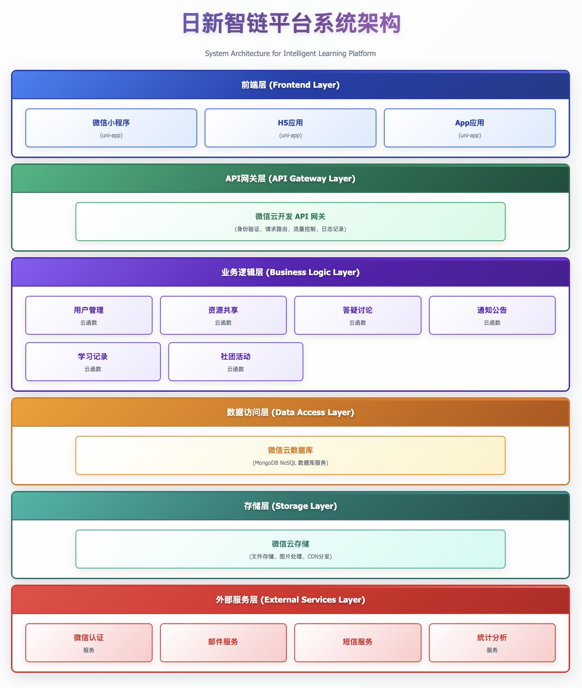

#### 2.2.2 技术架构选型说明

**前端技术栈：**
- **框架：** uni-app (基于Vue.js 2.x)
- **语言：** JavaScript ES6+
- **样式：** SCSS / CSS3
- **状态管理：** Vuex (根据项目规模选用)
- **UI组件：** 原生uni-app组件
- **构建工具：** HBuilderX

**实际项目结构：**
```
src/
├── pages/              # 页面目录
│   ├── index/         # 首页模块
│   ├── login/         # 登录模块  
│   ├── register/      # 注册模块
│   ├── profile/       # 个人中心模块
│   ├── resources/     # 资源管理模块
│   ├── discussion/    # 讨论模块
│   ├── activity/      # 活动模块
│   └── notification/  # 通知模块
├── static/           # 静态资源
│   ├── images/       # 图片资源
│   ├── icons/        # 图标资源
│   └── logo.png      # 应用logo
├── uni.scss         # 全局样式
└── main.ts          # 应用入口

cloudfunctions/       # 云函数目录
├── user/            # 用户管理云函数
├── resource/        # 资源管理云函数
└── discussion/      # 讨论管理云函数

utils/               # 工具函数
├── api.js          # API接口封装
├── auth.js         # 身份验证工具
└── index.js        # 通用工具函数
```

**后端技术栈：**
- **运行环境：** 微信云开发平台
- **云函数：** Node.js
- **数据库：** 云数据库 (MongoDB)
- **文件存储：** 云存储
- **身份验证：** 微信登录 + 独立用户系统

**开发工具链：**
- **IDE：** HBuilderX
- **版本控制：** Git
- **调试工具：** 微信开发者工具
- **测试工具：** 模拟器测试

### 2.3 处理流程设计

#### 2.3.1 用户登录流程图
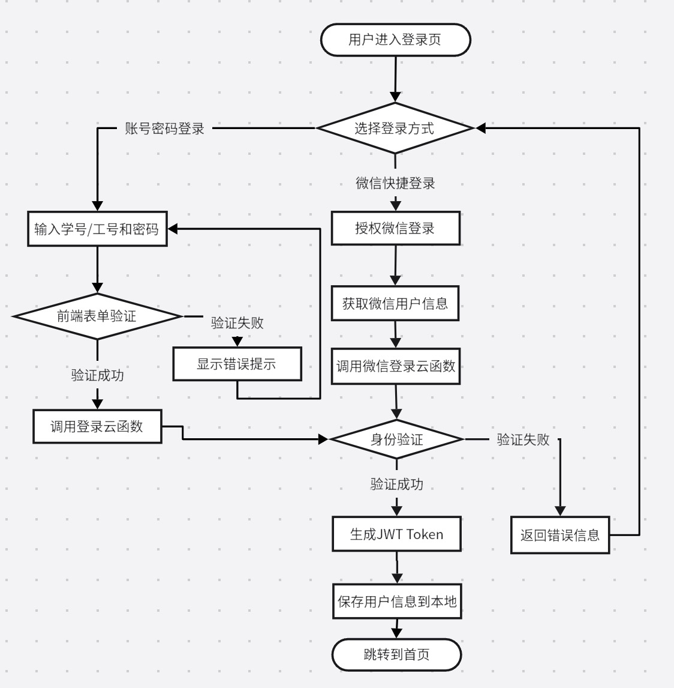

#### 2.3.2 资源上传流程图
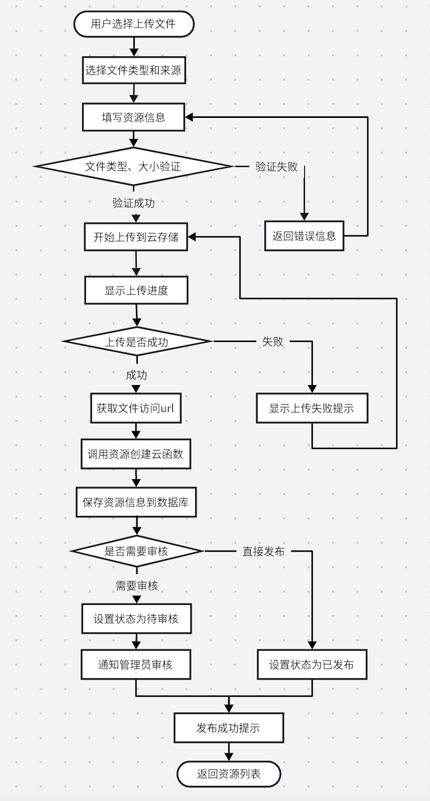

#### 2.3.3 讨论发布流程图
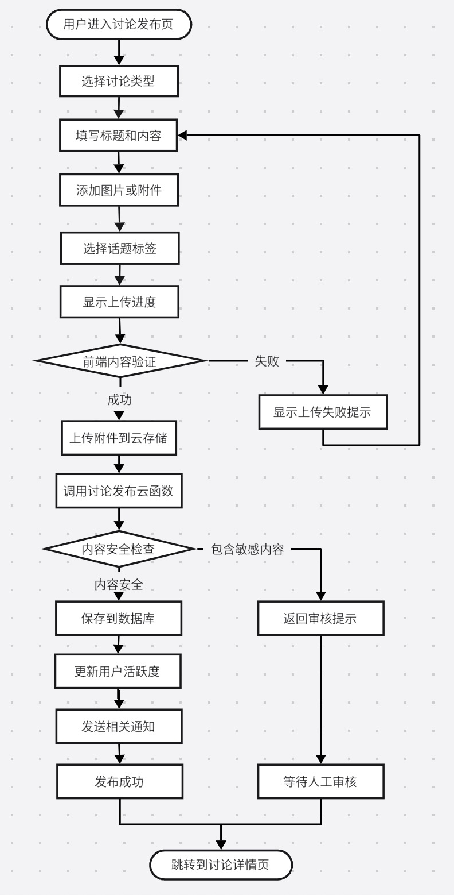

#### 2.3.4 系统部署架构图

**微信小程序云开发架构：**
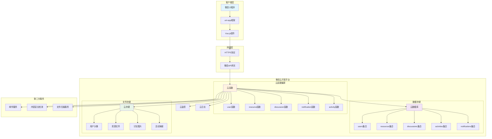
```mermaid
graph TB
    subgraph "客户端层"
        A[微信小程序]
        B[uni-app框架]
        C[Vue.js组件]
        A --> B
        B --> C
    end
    
    subgraph "网络层"
        D[HTTPS协议]
        E[微信API网关]
        C --> D
        D --> E
    end
    
    subgraph "微信云开发平台"
        F[云函数]
        G[云数据库]
        H[云存储]
        I[云监控]
        J[云日志]
        
        E --> F
        F --> G
        F --> H
        F --> I
        F --> J
        
        subgraph "云函数集群"
            F1[user函数]
            F2[resource函数] 
            F3[discussion函数]
            F4[notification函数]
            F5[activity函数]
            F --> F1
            F --> F2
            F --> F3
            F --> F4
            F --> F5
        end
        
        subgraph "数据存储"
            G1[users集合]
            G2[resources集合]
            G3[discussions集合]
            G4[activities集合]
            G5[notifications集合]
            G --> G1
            G --> G2
            G --> G3
            G --> G4
            G --> G5
        end
        
        subgraph "文件存储"
            H1[用户头像]
            H2[资源文件]
            H3[讨论图片]
            H4[活动海报]
            H --> H1
            H --> H2
            H --> H3
            H --> H4
        end
    end
    
    subgraph "第三方服务"
        K[邮件服务]
        L[内容安全检测]
        M[文件扫描服务]
        F --> K
        F --> L
        F --> M
    end
    
    style A fill:#e1f5fe
    style G fill:#f3e5f5
    style H fill:#e8f5e8
    style F fill:#fff3e0
```

**数据流架构图：**
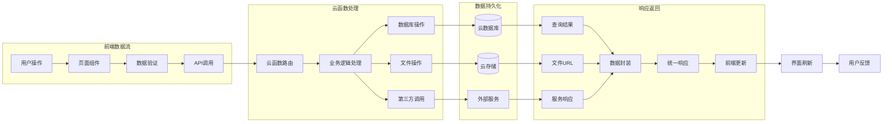
```mermaid
graph LR
    subgraph "前端数据流"
        A[用户操作] --> B[页面组件]
        B --> C[数据验证]
        C --> D[API调用]
    end
    
    subgraph "云函数处理"
        D --> E[云函数路由]
        E --> F[业务逻辑处理]
        F --> G[数据库操作]
        F --> H[文件操作]
        F --> I[第三方调用]
    end
    
    subgraph "数据持久化"
        G --> J[(云数据库)]
        H --> K[(云存储)]
        I --> L[外部服务]
    end
    
    subgraph "响应返回"
        J --> M[查询结果]
        K --> N[文件URL]
        L --> O[服务响应]
        M --> P[数据封装]
        N --> P
        O --> P
        P --> Q[统一响应]
        Q --> R[前端更新]
    end
    
    R --> S[界面刷新]
    S --> T[用户反馈]
```

#### 2.3.5 主要业务流程详细设计

**用户注册登录流程：**
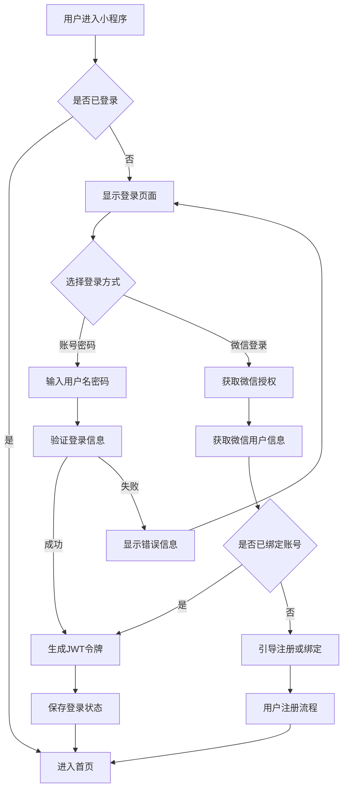
```mermaid
graph TD
    A[用户进入小程序] --> B{是否已登录}
    B -->|是| C[进入首页]
    B -->|否| D[显示登录页面]
    D --> E{选择登录方式}
    E -->|账号密码| F[输入用户名密码]
    E -->|微信登录| G[获取微信授权]
    F --> H[验证登录信息]
    G --> I[获取微信用户信息]
    H -->|成功| J[生成JWT令牌]
    H -->|失败| K[显示错误信息]
    I --> L{是否已绑定账号}
    L -->|是| J
    L -->|否| M[引导注册或绑定]
    J --> N[保存登录状态]
    N --> C
    K --> D
    M --> O[用户注册流程]
    O --> C
```

**资源上传业务流程：**
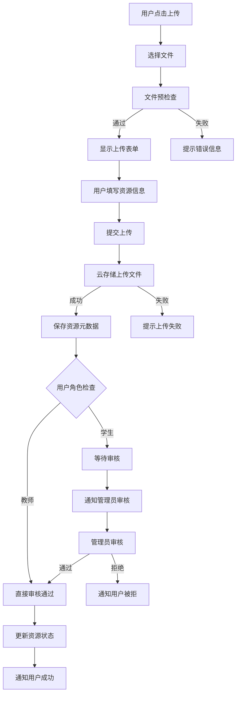
```mermaid
graph TD
    A[用户点击上传] --> B[选择文件]
    B --> C[文件预检查]
    C -->|通过| D[显示上传表单]
    C -->|失败| E[提示错误信息]
    D --> F[用户填写资源信息]
    F --> G[提交上传]
    G --> H[云存储上传文件]
    H -->|成功| I[保存资源元数据]
    H -->|失败| J[提示上传失败]
    I --> K{用户角色检查}
    K -->|教师| L[直接审核通过]
    K -->|学生| M[等待审核]
    L --> N[更新资源状态]
    M --> O[通知管理员审核]
    N --> P[通知用户成功]
    O --> Q[管理员审核]
    Q -->|通过| L
    Q -->|拒绝| R[通知用户被拒]
```

**讨论互动流程：**
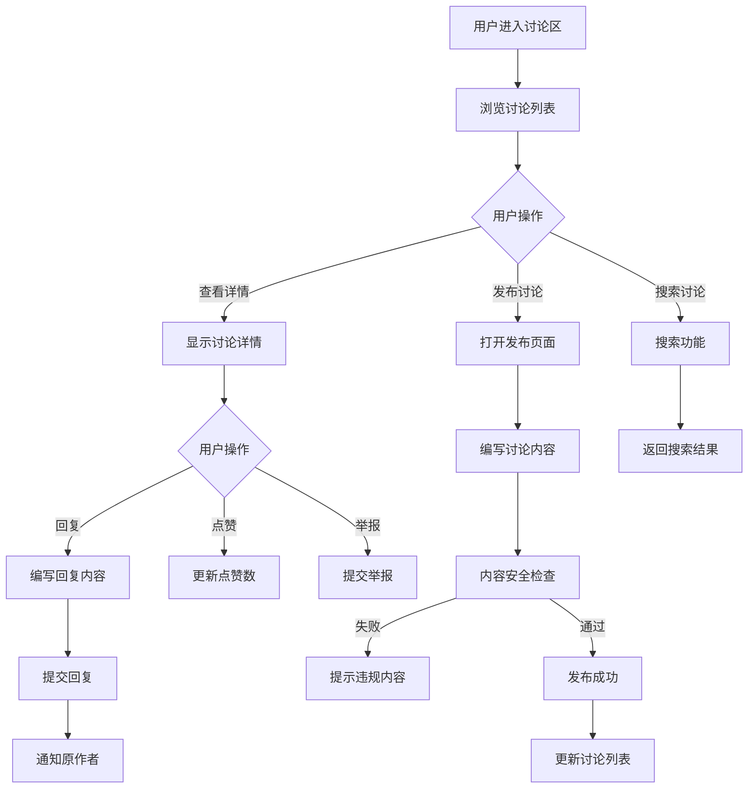
```mermaid
graph TD
    A[用户进入讨论区] --> B[浏览讨论列表]
    B --> C{用户操作}
    C -->|查看详情| D[显示讨论详情]
    C -->|发布讨论| E[打开发布页面]
    C -->|搜索讨论| F[搜索功能]
    D --> G{用户操作}
    G -->|回复| H[编写回复内容]
    G -->|点赞| I[更新点赞数]
    G -->|举报| J[提交举报]
    E --> K[编写讨论内容]
    K --> L[内容安全检查]
    L -->|通过| M[发布成功]
    L -->|失败| N[提示违规内容]
    H --> O[提交回复]
    O --> P[通知原作者]
    M --> Q[更新讨论列表]
    F --> R[返回搜索结果]
```

### 2.4 静态类图设计

#### 2.4.1 核心实体类图

```mermaid
classDiagram
    class User {
        -String userId
        -String username
        -String realName
        -String email
        -String phone
        -String avatar
        -String role
        -String college
        -String major
        -String grade
        -String status
        -Date createTime
        -Date lastLoginTime
        -Integer loginCount
        +register() Boolean
        +login(username, password) String
        +updateProfile(data) Boolean
        +changePassword(oldPwd, newPwd) Boolean
        +logout() Boolean
    }

    class Resource {
        -String resourceId
        -String title
        -String description
        -String fileUrl
        -String fileName
        -Long fileSize
        -String fileType
        -String category
        -Array tags
        -String difficulty
        -String uploaderId
        -Date uploadTime
        -Integer downloadCount
        -Integer viewCount
        -Float rating
        -String status
        +upload(fileData) String
        +download() InputStream
        +updateInfo(data) Boolean
        +addView() Boolean
        +addDownload() Boolean
        +rate(score) Boolean
    }

    class Discussion {
        -String discussionId
        -String parentId
        -String type
        -String title
        -String content
        -String authorId
        -String courseId
        -String resourceId
        -Array images
        -Array attachments
        -Array tags
        -Boolean isQuestion
        -Boolean isResolved
        -Integer likeCount
        -Integer replyCount
        -Integer viewCount
        -Boolean isAnonymous
        -String status
        -Date createTime
        -Date updateTime
        +publish() String
        +reply(content) String
        +like() Boolean
        +unlike() Boolean
        +markResolved() Boolean
        +hide() Boolean
        +delete() Boolean
    }

    class Activity {
        -String activityId
        -String title
        -String description
        -String type
        -String category
        -String organizerId
        -String organizerName
        -String organizationType
        -String posterUrl
        -String location
        -Date startTime
        -Date endTime
        -Date registrationDeadline
        -Integer maxParticipants
        -Integer currentParticipants
        -Object registrationConditions
        -Array tags
        -Array attachments
        -Integer viewCount
        -Integer likeCount
        -String status
        +create() String
        +register(userId) Boolean
        +cancel(userId) Boolean
        +checkIn(userId) Boolean
        +updateStatus(status) Boolean
    }

    class Notification {
        -String notificationId
        -String title
        -String content
        -String type
        -String priority
        -String senderId
        -String senderName
        -Array receiverIds
        -Object receiverConditions
        -String linkUrl
        -String imageUrl
        -Array isRead
        -Integer readCount
        -Integer totalCount
        -String status
        -Date publishTime
        -Date expireTime
        +send() Boolean
        +markRead(userId) Boolean
        +markAllRead(userId) Boolean
        +getUnreadCount(userId) Integer
    }

    class LearningRecord {
        -String recordId
        -String userId
        -String actionType
        -String targetType
        -String targetId
        -String targetTitle
        -Integer duration
        -Float progress
        -Float score
        -Object details
        -Object deviceInfo
        -Object location
        -Date createTime
        +record(action) String
        +getStats(userId) Object
        +getProgress(userId, targetId) Float
    }

    %% 关系定义
    User ||--o{ Resource : uploads
    User ||--o{ Discussion : authors
    User ||--o{ Activity : organizes
    User ||--o{ LearningRecord : generates
    User ||--o{ Notification : sends
    User }o--o{ Activity : participates
    Resource ||--o{ Discussion : discusses
    Discussion ||--o{ Discussion : replies
    Activity ||--o{ LearningRecord : tracks
    Resource ||--o{ LearningRecord : tracks
    Discussion ||--o{ LearningRecord : tracks
```

#### 2.4.2 服务层类图


```mermaid
classDiagram
    class UserService {
        +register(userData) Promise~Object~
        +login(username, password) Promise~Object~
        +getUserInfo(userId) Promise~Object~
        +updateProfile(userId, data) Promise~Object~
        +changePassword(userId, oldPwd, newPwd) Promise~Boolean~
        +logout(userId) Promise~Boolean~
        -validateUserData(data) Boolean
        -checkUniqueness(username, email) Promise~Boolean~
        -hashPassword(password) String
        -generateToken(user) String
    }

    class ResourceService {
        +uploadResource(fileData, resourceInfo) Promise~Object~
        +getResourceList(params) Promise~Object~
        +getResourceDetail(resourceId) Promise~Object~
        +downloadResource(resourceId) Promise~Object~
        +searchResources(keyword, filters) Promise~Object~
        +rateResource(resourceId, userId, score) Promise~Boolean~
        -validateFile(file) Boolean
        -generateFileName(originalName) String
        -updateDownloadCount(resourceId) Promise~Boolean~
    }

    class DiscussionService {
        +publishDiscussion(discussionData) Promise~Object~
        +getDiscussionList(params) Promise~Object~
        +getDiscussionDetail(discussionId) Promise~Object~
        +replyDiscussion(parentId, content, authorId) Promise~Object~
        +likeDiscussion(discussionId, userId) Promise~Boolean~
        +searchDiscussions(keyword, filters) Promise~Object~
        -validateContent(content) Boolean
        -checkPermission(userId, action) Boolean
        -notifyAuthor(discussionId, action) Promise~Boolean~
    }

    class ActivityService {
        +createActivity(activityData) Promise~Object~
        +getActivityList(params) Promise~Object~
        +getActivityDetail(activityId) Promise~Object~
        +registerActivity(activityId, userId, data) Promise~Boolean~
        +cancelRegistration(activityId, userId) Promise~Boolean~
        +checkInActivity(activityId, userId) Promise~Boolean~
        -validateActivityData(data) Boolean
        -checkRegistrationConditions(activity, user) Boolean
        -updateParticipantCount(activityId, increment) Promise~Boolean~
    }

    class NotificationService {
        +sendNotification(notificationData) Promise~Object~
        +getNotificationList(userId, params) Promise~Object~
        +markAsRead(notificationId, userId) Promise~Boolean~
        +markAllAsRead(userId) Promise~Boolean~
        +getUnreadCount(userId) Promise~Integer~
        -filterReceivers(conditions) Promise~Array~
        -sendPushMessage(userId, notification) Promise~Boolean~
    }

    class LearningService {
        +recordLearningActivity(userId, actionType, targetType, targetId, details) Promise~Object~
        +getLearningStats(userId, timeRange) Promise~Object~
        +getLearningProgress(userId, targetId) Promise~Object~
        +generateLearningReport(userId) Promise~Object~
        -calculateDuration(startTime, endTime) Integer
        -calculateProgress(actions) Float
        -updateUserStats(userId, actionType) Promise~Boolean~
    }

    %% 服务间依赖关系
    DiscussionService ..> NotificationService : uses
    ActivityService ..> NotificationService : uses
    ResourceService ..> LearningService : uses
    DiscussionService ..> LearningService : uses
    ActivityService ..> LearningService : uses
```

#### 2.4.3 前端组件类图

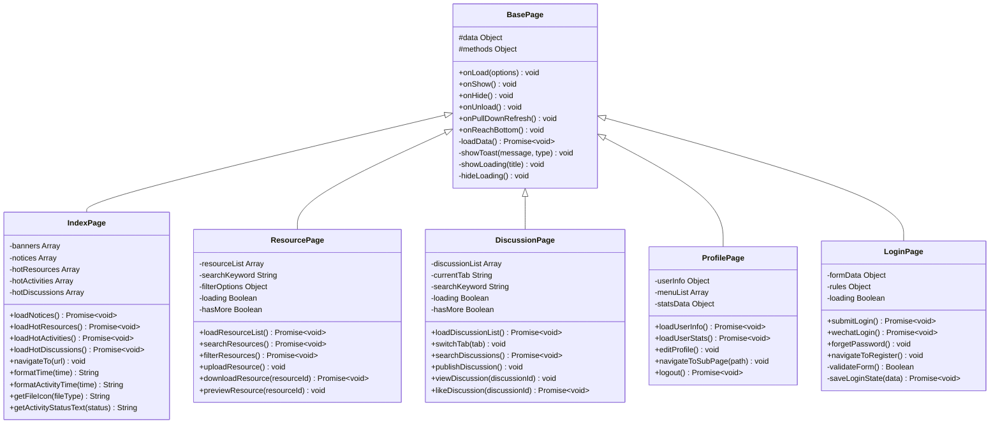
```mermaid
classDiagram
    class BasePage {
        #data Object
        #methods Object
        +onLoad(options) void
        +onShow() void
        +onHide() void
        +onUnload() void
        +onPullDownRefresh() void
        +onReachBottom() void
        -loadData() Promise~void~
        -showToast(message, type) void
        -showLoading(title) void
        -hideLoading() void
    }

    class IndexPage {
        -banners Array
        -notices Array
        -hotResources Array
        -hotActivities Array
        -hotDiscussions Array
        +loadNotices() Promise~void~
        +loadHotResources() Promise~void~
        +loadHotActivities() Promise~void~
        +loadHotDiscussions() Promise~void~
        +navigateTo(url) void
        +formatTime(time) String
        +formatActivityTime(time) String
        +getFileIcon(fileType) String
        +getActivityStatusText(status) String
    }

    class ResourcePage {
        -resourceList Array
        -searchKeyword String
        -filterOptions Object
        -loading Boolean
        -hasMore Boolean
        +loadResourceList() Promise~void~
        +searchResources() Promise~void~
        +filterResources() Promise~void~
        +uploadResource() void
        +downloadResource(resourceId) Promise~void~
        +previewResource(resourceId) void
    }

    class DiscussionPage {
        -discussionList Array
        -currentTab String
        -searchKeyword String
        -loading Boolean
        -hasMore Boolean
        +loadDiscussionList() Promise~void~
        +switchTab(tab) void
        +searchDiscussions() Promise~void~
        +publishDiscussion() void
        +viewDiscussion(discussionId) void
        +likeDiscussion(discussionId) Promise~void~
    }

    class ProfilePage {
        -userInfo Object
        -menuList Array
        -statsData Object
        +loadUserInfo() Promise~void~
        +loadUserStats() Promise~void~
        +editProfile() void
        +navigateToSubPage(path) void
        +logout() Promise~void~
    }

    class LoginPage {
        -formData Object
        -rules Object
        -loading Boolean
        +submitLogin() Promise~void~
        +wechatLogin() Promise~void~
        +forgetPassword() void
        +navigateToRegister() void
        -validateForm() Boolean
        -saveLoginState(data) Promise~void~
    }

    %% 继承关系
    BasePage <|-- IndexPage
    BasePage <|-- ResourcePage
    BasePage <|-- DiscussionPage
    BasePage <|-- ProfilePage
    BasePage <|-- LoginPage
```

---

## 3. 数据库设计

### 3.1 数据库概述

日新智链平台采用微信云数据库作为主要数据存储解决方案。云数据库基于MongoDB，提供NoSQL文档型数据库服务，具有高可用性、自动扩容和数据安全保障。

**数据库特点：**
- **文档型存储：** 支持复杂的嵌套数据结构
- **自动扩容：** 根据使用量自动调整存储和计算资源
- **数据安全：** 提供数据加密、访问控制和备份恢复
- **实时同步：** 支持数据实时同步和事件触发

### 3.2 数据库表设计

#### 3.2.1 用户表 (users)

| 字段名 | 类型 | 必填 | 描述 | 索引 |
|--------|------|------|------|------|
| _id | ObjectId | 是 | 用户唯一标识 | 主键 |
| username | String | 是 | 用户名(学号/工号) | 唯一索引 |
| password | String | 否 | 密码哈希值(微信登录可为空) | - |
| realName | String | 是 | 真实姓名 | - |
| email | String | 是 | 邮箱地址 | 唯一索引 |
| phone | String | 否 | 手机号码 | - |
| avatar | String | 否 | 头像URL | - |
| role | String | 是 | 用户角色(student/teacher/admin) | 普通索引 |
| college | String | 否 | 所属学院 | - |
| major | String | 否 | 专业 | - |
| grade | String | 否 | 年级 | - |
| wechatOpenId | String | 否 | 微信OpenId | 唯一索引 |
| wechatUnionId | String | 否 | 微信UnionId | - |
| status | String | 是 | 账户状态(active/inactive/banned) | - |
| lastLoginTime | Date | 否 | 最后登录时间 | - |
| loginCount | Number | 否 | 登录次数 | - |
| createTime | Date | 是 | 创建时间 | - |
| updateTime | Date | 是 | 更新时间 | - |

**数据示例：**
```json
{
  "_id": "507f1f77bcf86cd799439011",
  "username": "20240001",
  "password": "$2b$10$rOzPwHWJN85fEaVtOvMoGeFgZbKS2Qj...",
  "realName": "张三",
  "email": "zhangsan@emails.bjut.edu.cn",
  "phone": "13800138000",
  "avatar": "cloud://resource-1gfg6f.7265-resource-1gfg6f/avatars/user_001.jpg",
  "role": "student",
  "college": "软件学院",
  "major": "软件工程",
  "grade": "2024",
  "status": "active",
  "lastLoginTime": "2025-06-20T10:30:00.000Z",
  "loginCount": 25,
  "createTime": "2025-06-15T08:00:00.000Z",
  "updateTime": "2025-06-20T10:30:00.000Z"
}
```

#### 3.2.2 资源表 (resources)

| 字段名 | 类型 | 必填 | 描述 | 索引 |
|--------|------|------|------|------|
| _id | ObjectId | 是 | 资源唯一标识 | 主键 |
| title | String | 是 | 资源标题 | 文本索引 |
| description | String | 否 | 资源描述 | - |
| fileUrl | String | 是 | 文件云存储路径 | - |
| fileName | String | 是 | 原始文件名 | - |
| fileSize | Number | 是 | 文件大小(字节) | - |
| fileType | String | 是 | 文件类型 | 普通索引 |
| category | String | 是 | 资源分类 | 普通索引 |
| tags | Array | 否 | 标签数组 | - |
| courseId | String | 否 | 关联课程ID | - |
| uploaderId | String | 是 | 上传者ID | 普通索引 |
| uploaderName | String | 是 | 上传者姓名 | - |
| downloadCount | Number | 否 | 下载次数 | - |
| viewCount | Number | 否 | 浏览次数 | - |
| likeCount | Number | 否 | 点赞数 | - |
| rating | Number | 否 | 平均评分 | - |
| ratingCount | Number | 否 | 评分人数 | - |
| status | String | 是 | 审核状态(pending/approved/rejected) | 普通索引 |
| auditTime | Date | 否 | 审核时间 | - |
| auditRemark | String | 否 | 审核备注 | - |
| createTime | Date | 是 | 创建时间 | 普通索引 |
| updateTime | Date | 是 | 更新时间 | - |

#### 3.2.3 讨论表 (discussions)

| 字段名 | 类型 | 必填 | 描述 | 索引 |
|--------|------|------|------|------|
| _id | ObjectId | 是 | 讨论唯一标识 | 主键 |
| parentId | String | 否 | 父讨论ID(回复关系) | 普通索引 |
| type | String | 是 | 类型(post/reply/comment) | - |
| title | String | 否 | 讨论标题(主帖才有) | 文本索引 |
| content | String | 是 | 讨论内容 | 文本索引 |
| authorId | String | 是 | 作者ID | 普通索引 |
| authorName | String | 是 | 作者姓名 | - |
| authorAvatar | String | 否 | 作者头像 | - |
| courseId | String | 否 | 关联课程ID | - |
| resourceId | String | 否 | 关联资源ID | - |
| images | Array | 否 | 图片数组 | - |
| attachments | Array | 否 | 附件数组 | - |
| tags | Array | 否 | 话题标签 | - |
| isQuestion | Boolean | 否 | 是否为提问 | - |
| isResolved | Boolean | 否 | 问题是否已解决 | - |
| bestAnswerId | String | 否 | 最佳答案ID | - |
| likeCount | Number | 否 | 点赞数 | - |
| replyCount | Number | 否 | 回复数 | - |
| viewCount | Number | 否 | 浏览数 | - |
| isAnonymous | Boolean | 否 | 是否匿名 | - |
| status | String | 是 | 状态(normal/hidden/deleted) | - |
| createTime | Date | 是 | 创建时间 | 普通索引 |
| updateTime | Date | 是 | 更新时间 | - |

#### 3.2.4 通知表 (notifications)

| 字段名 | 类型 | 必填 | 描述 | 索引 |
|--------|------|------|------|------|
| _id | ObjectId | 是 | 通知唯一标识 | 主键 |
| title | String | 是 | 通知标题 | - |
| content | String | 是 | 通知内容 | - |
| type | String | 是 | 通知类型 | 普通索引 |
| priority | String | 否 | 优先级(high/medium/low) | - |
| senderId | String | 否 | 发送者ID | - |
| senderName | String | 否 | 发送者姓名 | - |
| receiverIds | Array | 否 | 接收者ID数组 | - |
| receiverConditions | Object | 否 | 接收者筛选条件 | - |
| linkUrl | String | 否 | 跳转链接 | - |
| imageUrl | String | 否 | 通知图片 | - |
| isRead | Array | 否 | 已读状态数组 | - |
| readCount | Number | 否 | 已读人数 | - |
| totalCount | Number | 否 | 总接收人数 | - |
| status | String | 是 | 状态(draft/published/expired) | - |
| publishTime | Date | 否 | 发布时间 | 普通索引 |
| expireTime | Date | 否 | 过期时间 | - |
| createTime | Date | 是 | 创建时间 | - |
| updateTime | Date | 是 | 更新时间 | - |

#### 3.2.5 学习记录表 (learning_records)

| 字段名 | 类型 | 必填 | 描述 | 索引 |
|--------|------|------|------|------|
| _id | ObjectId | 是 | 记录唯一标识 | 主键 |
| userId | String | 是 | 用户ID | 复合索引 |
| actionType | String | 是 | 行为类型 | 复合索引 |
| targetType | String | 是 | 目标类型(resource/discussion/activity) | - |
| targetId | String | 是 | 目标ID | - |
| targetTitle | String | 否 | 目标标题 | - |
| duration | Number | 否 | 持续时间(秒) | - |
| progress | Number | 否 | 进度百分比 | - |
| score | Number | 否 | 得分 | - |
| details | Object | 否 | 详细信息 | - |
| deviceInfo | Object | 否 | 设备信息 | - |
| location | Object | 否 | 位置信息 | - |
| createTime | Date | 是 | 创建时间 | 复合索引 |

复合索引：`{userId: 1, actionType: 1, createTime: -1}`

#### 3.2.6 活动表 (activities)

| 字段名 | 类型 | 必填 | 描述 | 索引 |
|--------|------|------|------|------|
| _id | ObjectId | 是 | 活动唯一标识 | 主键 |
| title | String | 是 | 活动标题 | 文本索引 |
| description | String | 是 | 活动描述 | - |
| type | String | 是 | 活动类型 | 普通索引 |
| category | String | 是 | 活动分类 | - |
| organizerId | String | 是 | 组织者ID | - |
| organizerName | String | 是 | 组织者名称 | - |
| organizationType | String | 是 | 组织者类型(club/department) | - |
| posterUrl | String | 否 | 活动海报URL | - |
| location | String | 是 | 活动地点 | - |
| startTime | Date | 是 | 开始时间 | 普通索引 |
| endTime | Date | 是 | 结束时间 | - |
| registrationDeadline | Date | 是 | 报名截止时间 | - |
| maxParticipants | Number | 否 | 最大参与人数 | - |
| currentParticipants | Number | 否 | 当前参与人数 | - |
| registrationConditions | Object | 否 | 报名条件 | - |
| tags | Array | 否 | 活动标签 | - |
| attachments | Array | 否 | 附件数组 | - |
| viewCount | Number | 否 | 浏览次数 | - |
| likeCount | Number | 否 | 点赞数 | - |
| status | String | 是 | 状态(draft/published/ongoing/completed/cancelled) | 普通索引 |
| createTime | Date | 是 | 创建时间 | - |
| updateTime | Date | 是 | 更新时间 | - |

#### 3.2.7 活动报名表 (activity_registrations)

| 字段名 | 类型 | 必填 | 描述 | 索引 |
|--------|------|------|------|------|
| _id | ObjectId | 是 | 报名记录唯一标识 | 主键 |
| activityId | String | 是 | 活动ID | 复合索引 |
| userId | String | 是 | 用户ID | 复合索引 |
| userName | String | 是 | 用户姓名 | - |
| userPhone | String | 否 | 用户手机号 | - |
| userEmail | String | 否 | 用户邮箱 | - |
| registrationData | Object | 否 | 报名表单数据 | - |
| status | String | 是 | 状态(registered/confirmed/cancelled/attended) | - |
| checkInTime | Date | 否 | 签到时间 | - |
| feedback | Object | 否 | 活动反馈 | - |
| createTime | Date | 是 | 报名时间 | - |
| updateTime | Date | 是 | 更新时间 | - |

复合索引：`{activityId: 1, userId: 1}`，保证一个用户只能报名一次同一个活动

### 3.3 外键关系设计

由于MongoDB是文档型数据库，不支持传统的外键约束，本系统通过应用层逻辑和数据一致性检查来维护数据关系。

#### 3.3.1 主要关系映射

**用户相关关系：**
- `resources.uploaderId` → `users._id` (一对多)
- `discussions.authorId` → `users._id` (一对多)
- `learning_records.userId` → `users._id` (一对多)
- `activity_registrations.userId` → `users._id` (一对多)

**资源相关关系：**
- `discussions.resourceId` → `resources._id` (一对多)
- `learning_records.targetId` → `resources._id` (多对多)

**讨论相关关系：**
- `discussions.parentId` → `discussions._id` (自关联，一对多)
- `discussions.bestAnswerId` → `discussions._id` (一对一)

**活动相关关系：**
- `activities.organizerId` → `users._id` (一对多)
- `activity_registrations.activityId` → `activities._id` (一对多)

#### 3.3.2 数据一致性保证策略

**1. 应用层事务控制：**
```javascript
// 云函数中的事务处理示例
const transaction = await db.startTransaction();
try {
  // 更新资源下载次数
  await transaction.collection('resources').doc(resourceId).update({
    downloadCount: db.command.inc(1)
  });
  
  // 记录用户下载行为
  await transaction.collection('learning_records').add({
    data: {
      userId: userId,
      actionType: 'download',
      targetType: 'resource',
      targetId: resourceId,
      createTime: new Date()
    }
  });
  
  await transaction.commit();
} catch (error) {
  await transaction.rollback();
  throw error;
}
```

**2. 数据校验规则：**
- 在云函数中检查关联数据的存在性
- 使用数据库触发器进行数据一致性检查
- 定期执行数据清理和修复脚本

**3. 冗余数据策略：**
- 在子文档中保存必要的父文档信息（如用户名、头像）
- 定期同步冗余数据以保持一致性
- 使用缓存策略减少查询压力

---

## 4. 接口设计

### 4.1 外部接口

#### 4.1.1 软件接口

**微信小程序API接口：**
- **wx.login()** - 获取微信登录凭证
- **wx.getUserProfile()** - 获取用户信息
- **wx.uploadFile()** - 文件上传
- **wx.downloadFile()** - 文件下载
- **wx.previewImage()** - 图片预览
- **wx.showShareMenu()** - 分享功能

**微信云开发接口：**
- **wx.cloud.callFunction()** - 调用云函数
- **wx.cloud.database()** - 数据库操作
- **wx.cloud.uploadFile()** - 云存储上传
- **wx.cloud.downloadFile()** - 云存储下载

**第三方服务接口：**
- **邮件服务API** - 发送验证邮件和通知邮件
- **短信服务API** - 发送短信验证码
- **OCR识别API** - 文档内容识别
- **内容安全API** - 敏感内容检测

#### 4.1.2 硬件接口

**客户端设备接口：**
- **摄像头接口** - 用于扫描二维码和拍照上传
- **麦克风接口** - 语音输入和录音功能
- **GPS定位接口** - 获取用户位置信息
- **文件系统接口** - 访问本地文件和相册

**网络接口：**
- **Wi-Fi网络** - 主要网络连接方式
- **移动数据网络** - 4G/5G网络支持
- **蓝牙接口** - 用于近场文件传输（扩展功能）

### 4.2 内部接口

#### 4.2.1 云函数接口规范

**接口调用格式：**
```javascript
// 前端调用云函数统一格式
const result = await wx.cloud.callFunction({
  name: 'functionName',
  data: {
    action: 'actionName',
    params: {
      // 具体参数
    }
  }
});
```

**响应数据格式：**
```javascript
// 云函数统一返回格式
{
  success: true,      // 操作是否成功
  code: 200,          // 状态码
  message: '操作成功', // 提示信息
  data: {             // 返回数据
    // 具体数据内容
  },
  timestamp: 1634567890123  // 时间戳
}
```

#### 4.2.2 用户管理接口

**用户注册接口 (user/register)**
```javascript
// 请求参数
{
  action: 'register',
  params: {
    username: 'string',      // 用户名
    password: 'string',      // 密码
    realName: 'string',      // 真实姓名
    email: 'string',         // 邮箱
    phone: 'string',         // 手机号(可选)
    college: 'string',       // 学院(可选)
    major: 'string'          // 专业(可选)
  }
}

// 响应数据
{
  success: true,
  code: 200,
  message: '注册成功',
  data: {
    userId: 'string',        // 用户ID
    token: 'string'          // JWT令牌
  }
}
```

**用户登录接口 (user/login)**
```javascript
// 请求参数
{
  action: 'login',
  params: {
    username: 'string',      // 用户名
    password: 'string'       // 密码
  }
}

// 响应数据
{
  success: true,
  code: 200,
  message: '登录成功',
  data: {
    token: 'string',         // JWT令牌
    userInfo: {
      id: 'string',
      username: 'string',
      realName: 'string',
      avatar: 'string',
      role: 'string',
      college: 'string',
      major: 'string'
    }
  }
}
```

#### 4.2.3 资源管理接口

**资源上传接口 (resource/upload)**
```javascript
// 请求参数
{
  action: 'create',
  params: {
    title: 'string',         // 资源标题
    description: 'string',   // 资源描述
    fileUrl: 'string',       // 文件URL
    fileName: 'string',      // 文件名
    fileSize: 'number',      // 文件大小
    fileType: 'string',      // 文件类型
    category: 'string',      // 分类
    tags: ['string'],        // 标签数组
    courseId: 'string'       // 课程ID(可选)
  }
}

// 响应数据
{
  success: true,
  code: 200,
  message: '上传成功',
  data: {
    resourceId: 'string'     // 资源ID
  }
}
```

**资源查询接口 (resource/query)**
```javascript
// 请求参数
{
  action: 'list',
  params: {
    keyword: 'string',       // 搜索关键词(可选)
    category: 'string',      // 分类筛选(可选)
    tags: ['string'],        // 标签筛选(可选)
    sortBy: 'string',        // 排序字段
    sortOrder: 'asc|desc',   // 排序方向
    page: 'number',          // 页码
    pageSize: 'number'       // 每页数量
  }
}

// 响应数据
{
  success: true,
  code: 200,
  message: '查询成功',
  data: {
    list: [{
      id: 'string',
      title: 'string',
      description: 'string',
      fileType: 'string',
      category: 'string',
      tags: ['string'],
      uploaderName: 'string',
      downloadCount: 'number',
      createTime: 'date'
    }],
    total: 'number',         // 总数量
    page: 'number',          // 当前页码
    pageSize: 'number'       // 每页数量
  }
}
```

#### 4.2.4 讨论管理接口

**发布讨论接口 (discussion/post)**
```javascript
// 请求参数
{
  action: 'create',
  params: {
    type: 'post',            // 讨论类型
    title: 'string',         // 标题
    content: 'string',       // 内容
    images: ['string'],      // 图片数组(可选)
    attachments: ['object'], // 附件数组(可选)
    tags: ['string'],        // 标签数组(可选)
    isQuestion: 'boolean',   // 是否为提问
    isAnonymous: 'boolean'   // 是否匿名
  }
}

// 响应数据
{
  success: true,
  code: 200,
  message: '发布成功',
  data: {
    discussionId: 'string'   // 讨论ID
  }
}
```

#### 4.2.5 通知管理接口

**发送通知接口 (notification/send)**
```javascript
// 请求参数
{
  action: 'send',
  params: {
    title: 'string',         // 通知标题
    content: 'string',       // 通知内容
    type: 'string',          // 通知类型
    priority: 'string',      // 优先级
    receiverIds: ['string'], // 接收者ID数组(可选)
    receiverConditions: {    // 接收者筛选条件(可选)
      role: ['string'],      // 角色筛选
      college: ['string'],   // 学院筛选
      grade: ['string']      // 年级筛选
    },
    linkUrl: 'string',       // 跳转链接(可选)
    imageUrl: 'string'       // 通知图片(可选)
  }
}

// 响应数据
{
  success: true,
  code: 200,
  message: '发送成功',
  data: {
    notificationId: 'string', // 通知ID
    totalCount: 'number'      // 发送总数
  }
}
```

#### 4.2.6 接口安全机制

**身份验证：**
- 所有接口调用需要携带有效的JWT令牌
- 令牌包含用户身份和权限信息
- 令牌过期自动刷新机制

**权限控制：**
- 基于角色的访问控制(RBAC)
- 接口级别的权限检查
- 数据级别的权限过滤

**请求限制：**
- 接口调用频率限制
- 单用户并发请求限制
- 文件上传大小限制

**数据校验：**
- 参数类型和格式校验
- 业务逻辑合法性检查
- SQL注入和XSS攻击防护

---

## 5. 模块详细设计

### 5.1 用户管理模块

#### 5.1.1 模块结构图

```
用户管理模块 (UserModule)
├── 组件层 (Components)
│   ├── LoginForm.vue          // 登录表单组件
│   ├── RegisterForm.vue       // 注册表单组件
│   ├── ProfileCard.vue        // 个人信息卡片
│   └── AvatarUpload.vue       // 头像上传组件
├── 页面层 (Pages)
│   ├── login.vue              // 登录页面
│   ├── register.vue           // 注册页面
│   └── profile.vue            // 个人中心页面
├── 服务层 (Services)
│   ├── userService.js         // 用户服务类
│   ├── authService.js         // 身份验证服务
│   └── profileService.js      // 个人信息服务
└── 云函数层 (Cloud Functions)
    ├── user/index.js          // 用户管理云函数
    ├── auth/index.js          // 身份验证云函数
    └── wechat/index.js        // 微信登录云函数
```

#### 5.1.2 用户管理模块流程图

**用户注册详细流程：**
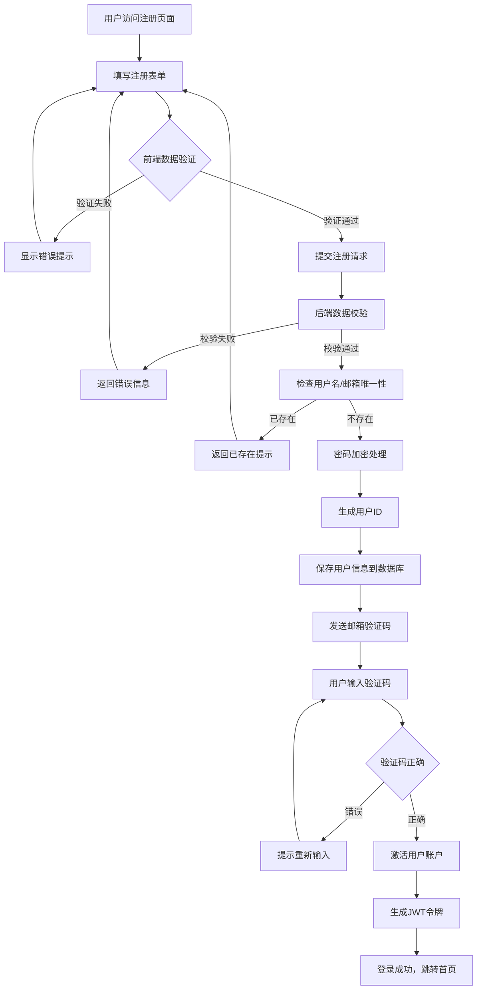
```mermaid
graph TD
    A[用户访问注册页面] --> B[填写注册表单]
    B --> C{前端数据验证}
    C -->|验证失败| D[显示错误提示]
    C -->|验证通过| E[提交注册请求]
    E --> F[后端数据校验]
    F -->|校验失败| G[返回错误信息]
    F -->|校验通过| H[检查用户名/邮箱唯一性]
    H -->|已存在| I[返回已存在提示]
    H -->|不存在| J[密码加密处理]
    J --> K[生成用户ID]
    K --> L[保存用户信息到数据库]
    L --> M[发送邮箱验证码]
    M --> N[用户输入验证码]
    N --> O{验证码正确}
    O -->|错误| P[提示重新输入]
    O -->|正确| Q[激活用户账户]
    Q --> R[生成JWT令牌]
    R --> S[登录成功，跳转首页]
    D --> B
    G --> B
    I --> B
    P --> N
```

**用户登录详细流程：**
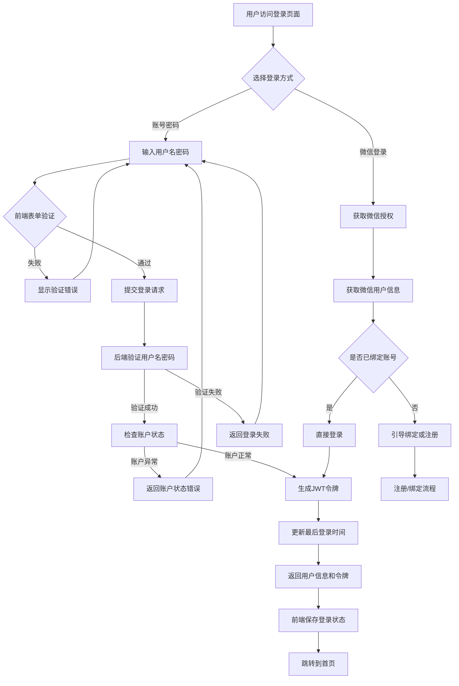
```mermaid
graph TD
    A[用户访问登录页面] --> B{选择登录方式}
    B -->|账号密码| C[输入用户名密码]
    B -->|微信登录| D[获取微信授权]
    C --> E{前端表单验证}
    E -->|失败| F[显示验证错误]
    E -->|通过| G[提交登录请求]
    D --> H[获取微信用户信息]
    H --> I{是否已绑定账号}
    I -->|是| J[直接登录]
    I -->|否| K[引导绑定或注册]
    G --> L[后端验证用户名密码]
    L -->|验证失败| M[返回登录失败]
    L -->|验证成功| N[检查账户状态]
    N -->|账户异常| O[返回账户状态错误]
    N -->|账户正常| P[生成JWT令牌]
    J --> P
    P --> Q[更新最后登录时间]
    Q --> R[返回用户信息和令牌]
    R --> S[前端保存登录状态]
    S --> T[跳转到首页]
    F --> C
    M --> C
    O --> C
    K --> U[注册/绑定流程]
```

**个人信息管理流程：**
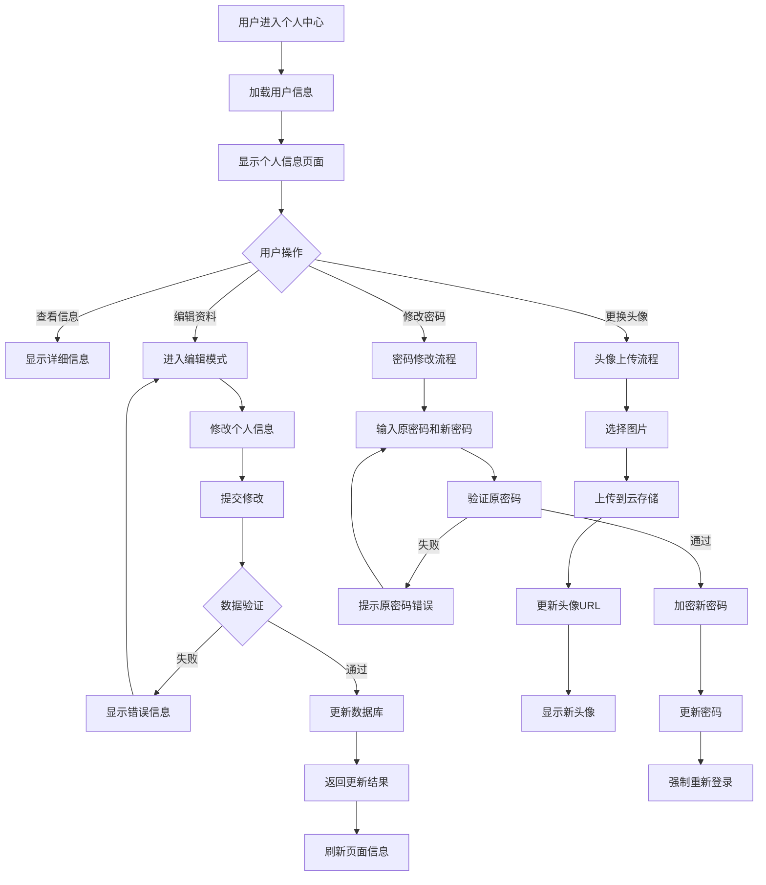
```mermaid
graph TD
    A[用户进入个人中心] --> B[加载用户信息]
    B --> C[显示个人信息页面]
    C --> D{用户操作}
    D -->|查看信息| E[显示详细信息]
    D -->|编辑资料| F[进入编辑模式]
    D -->|更换头像| G[头像上传流程]
    D -->|修改密码| H[密码修改流程]
    F --> I[修改个人信息]
    I --> J[提交修改]
    J --> K{数据验证}
    K -->|失败| L[显示错误信息]
    K -->|通过| M[更新数据库]
    M --> N[返回更新结果]
    N --> O[刷新页面信息]
    G --> P[选择图片]
    P --> Q[上传到云存储]
    Q --> R[更新头像URL]
    R --> S[显示新头像]
    H --> T[输入原密码和新密码]
    T --> U[验证原密码]
    U -->|失败| V[提示原密码错误]
    U -->|通过| W[加密新密码]
    W --> X[更新密码]
    X --> Y[强制重新登录]
    L --> F
    V --> T
```

#### 5.1.3 关键类设计

**UserService类设计：**
```javascript
class UserService {
  /**
   * 用户注册
   * @param {Object} userData - 用户数据
   * @returns {Promise<Object>} 注册结果
   */
  async register(userData) {
    // 1. 数据验证
    this.validateUserData(userData);
    
    // 2. 检查用户名和邮箱唯一性
    await this.checkUniqueness(userData.username, userData.email);
    
    // 3. 密码加密
    const hashedPassword = await this.hashPassword(userData.password);
    
    // 4. 调用云函数创建用户
    const result = await wx.cloud.callFunction({
      name: 'user',
      data: {
        action: 'register',
        params: {
          ...userData,
          password: hashedPassword
        }
      }
    });
    
    return result.result;
  }

  /**
   * 用户登录
   * @param {string} username - 用户名
   * @param {string} password - 密码
   * @returns {Promise<Object>} 登录结果
   */
  async login(username, password) {
    // 1. 参数验证
    if (!username || !password) {
      throw new Error('用户名和密码不能为空');
    }
    
    // 2. 调用云函数验证登录
    const result = await wx.cloud.callFunction({
      name: 'user',
      data: {
        action: 'login',
        params: { username, password }
      }
    });
    
    // 3. 保存登录状态
    if (result.result.success) {
      await this.saveLoginState(result.result.data);
    }
    
    return result.result;
  }

  /**
   * 获取用户信息
   * @param {string} userId - 用户ID
   * @returns {Promise<Object>} 用户信息
   */
  async getUserInfo(userId) {
    const result = await wx.cloud.callFunction({
      name: 'user',
      data: {
        action: 'getInfo',
        params: { userId }
      }
    });
    
    return result.result.data;
  }

  /**
   * 更新用户信息
   * @param {string} userId - 用户ID
   * @param {Object} updateData - 更新数据
   * @returns {Promise<Object>} 更新结果
   */
  async updateProfile(userId, updateData) {
    // 1. 数据验证
    this.validateUpdateData(updateData);
    
    // 2. 调用云函数更新
    const result = await wx.cloud.callFunction({
      name: 'user',
      data: {
        action: 'updateProfile',
        params: { userId, ...updateData }
      }
    });
    
    // 3. 更新本地缓存
    if (result.result.success) {
      await this.updateLocalUserInfo(updateData);
    }
    
    return result.result;
  }

  // 私有方法
  validateUserData(userData) { /* 用户数据验证逻辑 */ }
  validateUpdateData(updateData) { /* 更新数据验证逻辑 */ }
  checkUniqueness(username, email) { /* 唯一性检查逻辑 */ }
  hashPassword(password) { /* 密码哈希逻辑 */ }
  saveLoginState(data) { /* 保存登录状态逻辑 */ }
  updateLocalUserInfo(data) { /* 更新本地用户信息逻辑 */ }
}
```

#### 5.1.3 用户注册流程伪代码

```
FUNCTION registerUser(userData)
BEGIN
    // Step 1: 输入验证
    IF userData is empty OR required fields missing THEN
        RETURN error("缺少必要信息")
    END IF
    
    // Step 2: 格式验证
    IF NOT isValidEmail(userData.email) THEN
        RETURN error("邮箱格式不正确")
    END IF
    
    IF NOT isValidPassword(userData.password) THEN
        RETURN error("密码格式不符合要求")
    END IF
    
    // Step 3: 唯一性检查
    existingUser = checkUserExists(userData.username, userData.email)
    IF existingUser THEN
        RETURN error("用户名或邮箱已存在")
    END IF
    
    // Step 4: 密码加密
    hashedPassword = bcrypt.hash(userData.password)
    
    // Step 5: 创建用户记录
    newUser = {
        username: userData.username,
        password: hashedPassword,
        realName: userData.realName,
        email: userData.email,
        role: 'student',
        status: 'active',
        createTime: currentTime,
        updateTime: currentTime
    }
    
    // Step 6: 保存到数据库
    userId = database.insert('users', newUser)
    
    // Step 7: 生成JWT令牌
    token = generateJWT({
        userId: userId,
        username: userData.username,
        role: 'student'
    })
    
    // Step 8: 记录操作日志
    logUserAction(userId, 'register', clientInfo)
    
    // Step 9: 发送欢迎邮件
    sendWelcomeEmail(userData.email, userData.realName)
    
    RETURN success({
        userId: userId,
        token: token,
        message: "注册成功"
    })
END FUNCTION
```

### 5.2 资源共享模块

#### 5.2.1 模块结构图

```
资源共享模块 (ResourceModule)
├── 组件层 (Components)
│   ├── ResourceCard.vue       // 资源卡片组件
│   ├── ResourceList.vue       // 资源列表组件
│   ├── UploadPanel.vue        // 上传面板组件
│   ├── SearchBar.vue          // 搜索栏组件
│   └── FilterPanel.vue        // 筛选面板组件
├── 页面层 (Pages)
│   ├── resources.vue          // 资源列表页面
│   ├── upload.vue             // 资源上传页面
│   └── detail.vue             // 资源详情页面
├── 服务层 (Services)
│   ├── resourceService.js     // 资源服务类
│   ├── uploadService.js       // 上传服务类
│   └── searchService.js       // 搜索服务类
└── 云函数层 (Cloud Functions)
    ├── resource/index.js      // 资源管理云函数
    ├── upload/index.js        // 文件上传云函数
    └── search/index.js        // 搜索云函数
```

#### 5.2.2 资源共享模块流程图

**资源上传详细流程：**
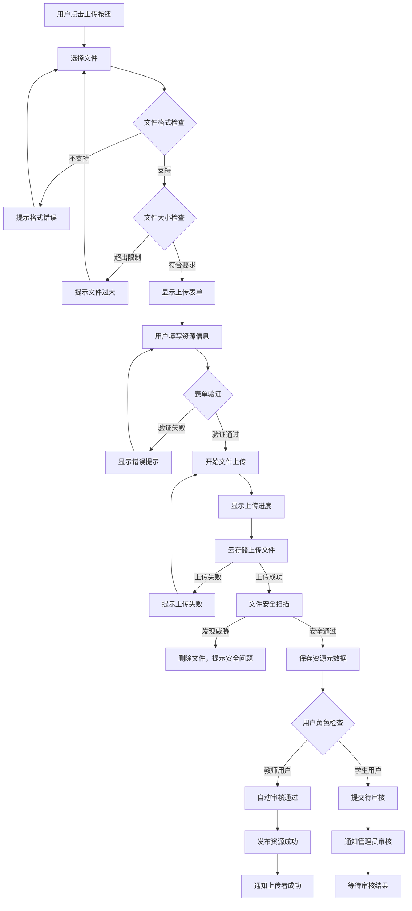
```mermaid
graph TD
    A[用户点击上传按钮] --> B[选择文件]
    B --> C{文件格式检查}
    C -->|不支持| D[提示格式错误]
    C -->|支持| E{文件大小检查}
    E -->|超出限制| F[提示文件过大]
    E -->|符合要求| G[显示上传表单]
    G --> H[用户填写资源信息]
    H --> I{表单验证}
    I -->|验证失败| J[显示错误提示]
    I -->|验证通过| K[开始文件上传]
    K --> L[显示上传进度]
    L --> M[云存储上传文件]
    M -->|上传失败| N[提示上传失败]
    M -->|上传成功| O[文件安全扫描]
    O -->|发现威胁| P[删除文件，提示安全问题]
    O -->|安全通过| Q[保存资源元数据]
    Q --> R{用户角色检查}
    R -->|教师用户| S[自动审核通过]
    R -->|学生用户| T[提交待审核]
    S --> U[发布资源成功]
    T --> V[通知管理员审核]
    U --> W[通知上传者成功]
    V --> X[等待审核结果]
    D --> B
    F --> B
    J --> H
    N --> K
```

**资源浏览和搜索流程：**
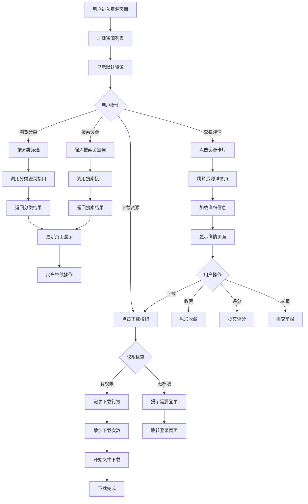
```mermaid
graph TD
    A[用户进入资源页面] --> B[加载资源列表]
    B --> C[显示默认资源]
    C --> D{用户操作}
    D -->|浏览分类| E[按分类筛选]
    D -->|搜索资源| F[输入搜索关键词]
    D -->|查看详情| G[点击资源卡片]
    D -->|下载资源| H[点击下载按钮]
    E --> I[调用分类查询接口]
    F --> J[调用搜索接口]
    G --> K[跳转资源详情页]
    H --> L{权限检查}
    I --> M[返回分类结果]
    J --> N[返回搜索结果]
    K --> O[加载详细信息]
    L -->|无权限| P[提示需要登录]
    L -->|有权限| Q[记录下载行为]
    M --> R[更新页面显示]
    N --> R
    O --> S[显示详情页面]
    Q --> T[增加下载次数]
    T --> U[开始文件下载]
    U --> V[下载完成]
    P --> W[跳转登录页面]
    R --> X[用户继续操作]
    S --> Y{用户操作}
    Y -->|下载| H
    Y -->|收藏| Z[添加收藏]
    Y -->|评分| AA[提交评分]
    Y -->|举报| BB[提交举报]
```

**资源审核流程：**
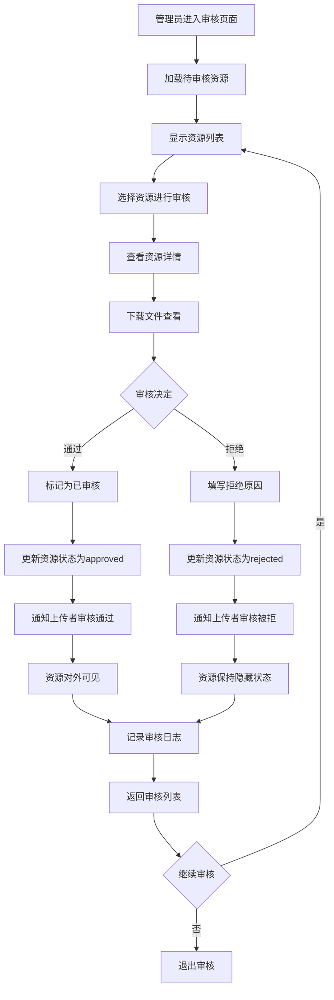
```mermaid
graph TD
    A[管理员进入审核页面] --> B[加载待审核资源]
    B --> C[显示资源列表]
    C --> D[选择资源进行审核]
    D --> E[查看资源详情]
    E --> F[下载文件查看]
    F --> G{审核决定}
    G -->|通过| H[标记为已审核]
    G -->|拒绝| I[填写拒绝原因]
    H --> J[更新资源状态为approved]
    I --> K[更新资源状态为rejected]
    J --> L[通知上传者审核通过]
    K --> M[通知上传者审核被拒]
    L --> N[资源对外可见]
    M --> O[资源保持隐藏状态]
    N --> P[记录审核日志]
    O --> P
    P --> Q[返回审核列表]
    Q --> R{继续审核}
    R -->|是| C
    R -->|否| S[退出审核]
```

#### 5.2.3 资源上传流程伪代码

```
FUNCTION uploadResource(fileData, resourceInfo)
BEGIN
    // Step 1: 文件验证
    IF fileData.size > MAX_FILE_SIZE THEN
        RETURN error("文件大小超出限制")
    END IF
    
    IF NOT isAllowedFileType(fileData.type) THEN
        RETURN error("不支持的文件类型")
    END IF
    
    // Step 2: 生成文件路径
    fileName = generateUniqueFileName(fileData.name)
    filePath = "resources/" + userId + "/" + fileName
    
    // Step 3: 上传到云存储
    uploadResult = cloudStorage.upload(filePath, fileData)
    IF NOT uploadResult.success THEN
        RETURN error("文件上传失败")
    END IF
    
    // Step 4: 文件安全检查
    securityCheck = scanFileForVirus(uploadResult.fileID)
    IF securityCheck.hasThreat THEN
        cloudStorage.delete(uploadResult.fileID)
        RETURN error("文件包含恶意内容")
    END IF
    
    // Step 5: 提取文件元信息
    metadata = extractFileMetadata(uploadResult.fileID)
    
    // Step 6: 创建资源记录
    resourceData = {
        title: resourceInfo.title,
        description: resourceInfo.description,
        fileUrl: uploadResult.fileID,
        fileName: fileData.name,
        fileSize: fileData.size,
        fileType: fileData.type,
        category: resourceInfo.category,
        tags: resourceInfo.tags,
        uploaderId: currentUserId,
        uploaderName: currentUser.realName,
        status: getUserRole() == 'teacher' ? 'approved' : 'pending',
        createTime: currentTime,
        updateTime: currentTime
    }
    
    // Step 7: 保存到数据库
    resourceId = database.insert('resources', resourceData)
    
    // Step 8: 创建索引
    searchIndex.addDocument(resourceId, {
        title: resourceData.title,
        description: resourceData.description,
        tags: resourceData.tags,
        category: resourceData.category
    })
    
    // Step 9: 通知相关用户
    IF resourceData.status == 'pending' THEN
        notifyAdminForReview(resourceId)
    ELSE
        notifyFollowersOfNewResource(currentUserId, resourceId)
    END IF
    
    // Step 10: 记录用户行为
    recordLearningActivity(currentUserId, 'upload', 'resource', resourceId)
    
    RETURN success({
        resourceId: resourceId,
        message: "上传成功"
    })
END FUNCTION
```

### 5.3 答疑讨论模块

#### 5.3.1 模块结构图

```
答疑讨论模块 (DiscussionModule)
├── 组件层 (Components)
│   ├── DiscussionCard.vue     // 讨论卡片组件
│   ├── DiscussionList.vue     // 讨论列表组件
│   ├── ReplyList.vue          // 回复列表组件
│   ├── PostEditor.vue         // 发帖编辑器组件
│   └── RichTextEditor.vue     // 富文本编辑器组件
├── 页面层 (Pages)
│   ├── discussion.vue         // 讨论区页面
│   ├── post.vue               // 发布讨论页面
│   └── detail.vue             // 讨论详情页面
├── 服务层 (Services)
│   ├── discussionService.js   // 讨论服务类
│   ├── replyService.js        // 回复服务类
│   └── moderationService.js   // 内容审核服务类
└── 云函数层 (Cloud Functions)
    ├── discussion/index.js    // 讨论管理云函数
    ├── reply/index.js         // 回复管理云函数
    └── moderation/index.js    // 内容审核云函数
```

#### 5.3.2 讨论模块流程图

**发布讨论流程：**
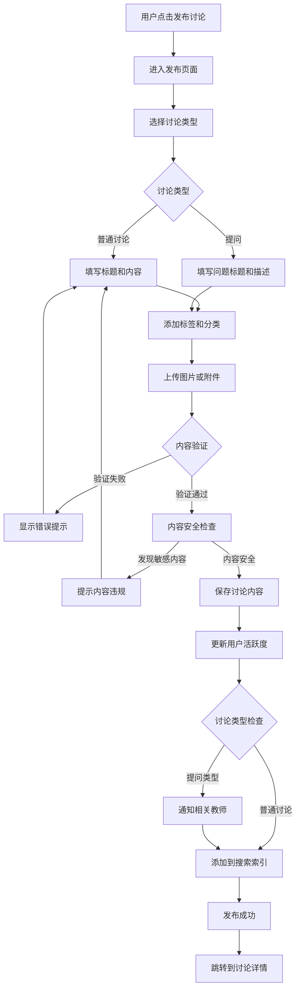
```mermaid
graph TD
    A[用户点击发布讨论] --> B[进入发布页面]
    B --> C[选择讨论类型]
    C --> D{讨论类型}
    D -->|普通讨论| E[填写标题和内容]
    D -->|提问| F[填写问题标题和描述]
    E --> G[添加标签和分类]
    F --> G
    G --> H[上传图片或附件]
    H --> I{内容验证}
    I -->|验证失败| J[显示错误提示]
    I -->|验证通过| K[内容安全检查]
    K -->|发现敏感内容| L[提示内容违规]
    K -->|内容安全| M[保存讨论内容]
    M --> N[更新用户活跃度]
    N --> O{讨论类型检查}
    O -->|提问类型| P[通知相关教师]
    O -->|普通讨论| Q[添加到搜索索引]
    P --> Q
    Q --> R[发布成功]
    R --> S[跳转到讨论详情]
    J --> E
    L --> E
```

**讨论互动流程：**
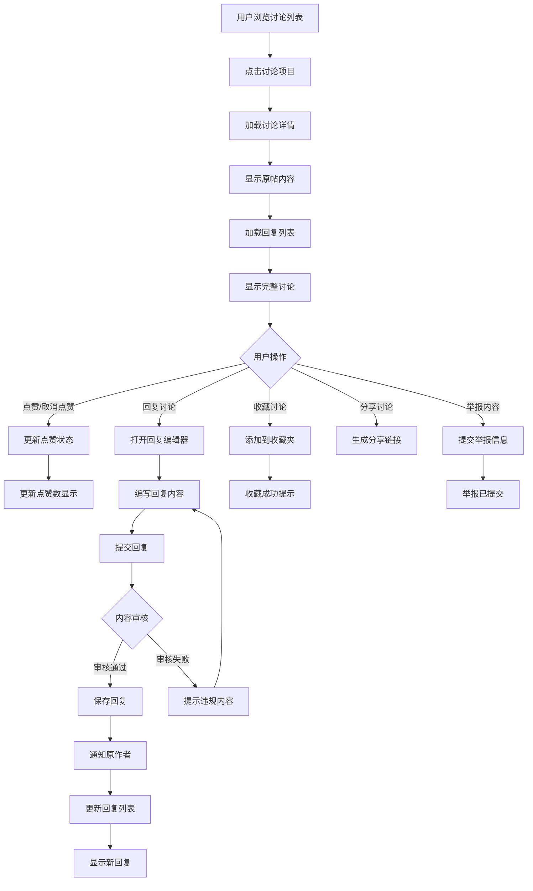
```mermaid
graph TD
    A[用户浏览讨论列表] --> B[点击讨论项目]
    B --> C[加载讨论详情]
    C --> D[显示原帖内容]
    D --> E[加载回复列表]
    E --> F[显示完整讨论]
    F --> G{用户操作}
    G -->|点赞/取消点赞| H[更新点赞状态]
    G -->|回复讨论| I[打开回复编辑器]
    G -->|收藏讨论| J[添加到收藏夹]
    G -->|分享讨论| K[生成分享链接]
    G -->|举报内容| L[提交举报信息]
    H --> M[更新点赞数显示]
    I --> N[编写回复内容]
    N --> O[提交回复]
    O --> P{内容审核}
    P -->|审核通过| Q[保存回复]
    P -->|审核失败| R[提示违规内容]
    Q --> S[通知原作者]
    S --> T[更新回复列表]
    T --> U[显示新回复]
    J --> V[收藏成功提示]
    L --> W[举报已提交]
    R --> N
```

**最佳答案标记流程：**
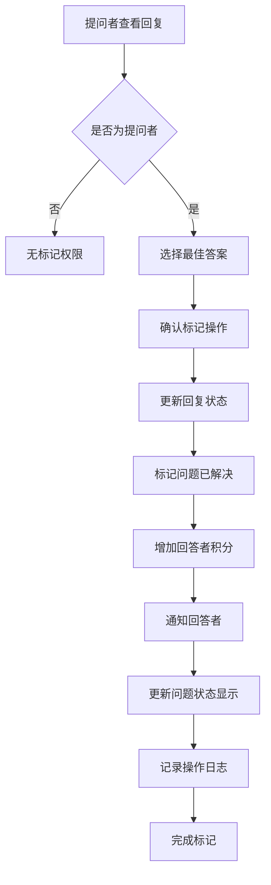
```mermaid
graph TD
    A[提问者查看回复] --> B{是否为提问者}
    B -->|否| C[无标记权限]
    B -->|是| D[选择最佳答案]
    D --> E[确认标记操作]
    E --> F[更新回复状态]
    F --> G[标记问题已解决]
    G --> H[增加回答者积分]
    H --> I[通知回答者]
    I --> J[更新问题状态显示]
    J --> K[记录操作日志]
    K --> L[完成标记]
```

**内容管理流程：**
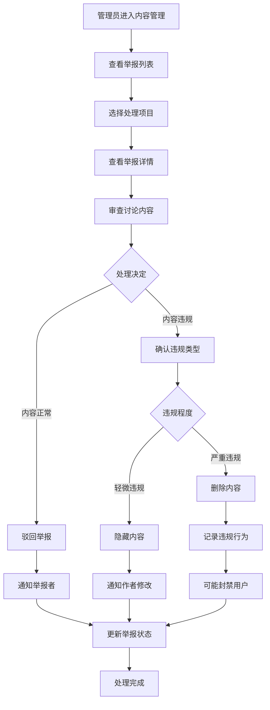
```mermaid
graph TD
    A[管理员进入内容管理] --> B[查看举报列表]
    B --> C[选择处理项目]
    C --> D[查看举报详情]
    D --> E[审查讨论内容]
    E --> F{处理决定}
    F -->|内容正常| G[驳回举报]
    F -->|内容违规| H[确认违规类型]
    G --> I[通知举报者]
    H --> J{违规程度}
    J -->|轻微违规| K[隐藏内容]
    J -->|严重违规| L[删除内容]
    K --> M[通知作者修改]
    L --> N[记录违规行为]
    N --> O[可能封禁用户]
    I --> P[更新举报状态]
    M --> P
    O --> P
    P --> Q[处理完成]
```

#### 5.3.3 讨论发布流程伪代码

```
FUNCTION publishDiscussion(discussionData)
BEGIN
    // Step 1: 内容验证
    IF discussionData.content is empty THEN
        RETURN error("内容不能为空")
    END IF
    
    IF length(discussionData.content) > MAX_CONTENT_LENGTH THEN
        RETURN error("内容长度超出限制")
    END IF
    
    // Step 2: 敏感内容检测
    contentCheck = moderationService.checkContent(discussionData.content)
    IF contentCheck.hasSensitiveWords THEN
        RETURN error("内容包含敏感词汇")
    END IF
    
    // Step 3: 图片处理
    processedImages = []
    FOR each image in discussionData.images DO
        // 压缩图片
        compressedImage = compressImage(image)
        // 上传到云存储
        uploadResult = cloudStorage.upload("discussions/images/", compressedImage)
        processedImages.append(uploadResult.fileID)
    END FOR
    
    // Step 4: 创建讨论记录
    discussion = {
        type: 'post',
        title: discussionData.title,
        content: discussionData.content,
        authorId: currentUserId,
        authorName: currentUser.realName,
        authorAvatar: currentUser.avatar,
        images: processedImages,
        attachments: discussionData.attachments,
        tags: discussionData.tags,
        isQuestion: discussionData.isQuestion,
        isAnonymous: discussionData.isAnonymous,
        likeCount: 0,
        replyCount: 0,
        viewCount: 0,
        status: 'normal',
        createTime: currentTime,
        updateTime: currentTime
    }
    
    // Step 5: 保存到数据库
    discussionId = database.insert('discussions', discussion)
    
    // Step 6: 更新用户活跃度
    updateUserActivity(currentUserId, 'post_discussion')
    
    // Step 7: 推送通知
    IF discussionData.isQuestion THEN
        // 通知相关教师
        notifyTeachersForQuestion(discussionId, discussionData.tags)
    END IF
    
    // Step 8: 添加到搜索索引
    searchIndex.addDocument(discussionId, {
        title: discussion.title,
        content: discussion.content,
        tags: discussion.tags,
        type: 'discussion'
    })
    
    RETURN success({
        discussionId: discussionId,
        message: "发布成功"
    })
END FUNCTION
```

### 5.4 通知公告模块

#### 5.4.1 模块结构图

```
通知公告模块 (NotificationModule)
├── 组件层 (Components)
│   ├── NotificationCard.vue   // 通知卡片组件
│   ├── NotificationList.vue   // 通知列表组件
│   ├── NotificationBell.vue   // 通知铃铛组件
│   └── AnnouncementBanner.vue // 公告横幅组件
├── 页面层 (Pages)
│   ├── notification.vue       // 通知列表页面
│   └── detail.vue             // 通知详情页面
├── 服务层 (Services)
│   ├── notificationService.js // 通知服务类
│   ├── pushService.js         // 推送服务类
│   └── subscriptionService.js // 订阅服务类
└── 云函数层 (Cloud Functions)
    ├── notification/index.js  // 通知管理云函数
    ├── push/index.js          // 消息推送云函数
    └── scheduler/index.js     // 定时任务云函数
```

#### 5.4.2 通知推送流程伪代码

```
FUNCTION sendNotification(notificationData)
BEGIN
    // Step 1: 验证发送权限
    IF NOT hasPermissionToSend(currentUserId, notificationData.type) THEN
        RETURN error("无权限发送此类通知")
    END IF
    
    // Step 2: 验证通知内容
    IF notificationData.title is empty OR notificationData.content is empty THEN
        RETURN error("标题和内容不能为空")
    END IF
    
    // Step 3: 确定接收者
    receivers = []
    IF notificationData.receiverIds is not empty THEN
        receivers = notificationData.receiverIds
    ELSE
        // 根据条件筛选接收者
        receivers = filterUsersByConditions(notificationData.receiverConditions)
    END IF
    
    // Step 4: 创建通知记录
    notification = {
        title: notificationData.title,
        content: notificationData.content,
        type: notificationData.type,
        priority: notificationData.priority,
        senderId: currentUserId,
        senderName: currentUser.realName,
        receiverIds: receivers,
        linkUrl: notificationData.linkUrl,
        imageUrl: notificationData.imageUrl,
        isRead: [],
        readCount: 0,
        totalCount: length(receivers),
        status: 'published',
        publishTime: currentTime,
        createTime: currentTime,
        updateTime: currentTime
    }
    
    // Step 5: 保存到数据库
    notificationId = database.insert('notifications', notification)
    
    // Step 6: 批量推送消息
    pushResults = []
    FOR each receiverId in receivers DO
        // 检查用户推送设置
        userSettings = getUserNotificationSettings(receiverId)
        IF shouldSendPush(notificationData.type, userSettings) THEN
            pushResult = sendPushMessage(receiverId, notification)
            pushResults.append(pushResult)
        END IF
        
        // 创建用户通知记录
        createUserNotification(receiverId, notificationId)
    END FOR
    
    // Step 7: 更新推送统计
    updateNotificationStats(notificationId, pushResults)
    
    // Step 8: 记录操作日志
    logOperation(currentUserId, 'send_notification', notificationId)
    
    RETURN success({
        notificationId: notificationId,
        totalCount: length(receivers),
        pushCount: count(successful pushResults),
        message: "通知发送成功"
    })
END FUNCTION
```

### 5.5 学习记录模块

#### 5.5.1 模块结构图

```
学习记录模块 (LearningModule)
├── 组件层 (Components)
│   ├── LearningChart.vue      // 学习图表组件
│   ├── ProgressBar.vue        // 进度条组件
│   ├── AchievementCard.vue    // 成就卡片组件
│   └── TimelineView.vue       // 时间轴视图组件
├── 页面层 (Pages)
│   └── learning.vue           // 学习记录页面
├── 服务层 (Services)
│   ├── learningService.js     // 学习服务类
│   ├── analyticsService.js    // 分析服务类
│   └── trackingService.js     // 跟踪服务类
└── 云函数层 (Cloud Functions)
    ├── learning/index.js      // 学习记录云函数
    ├── analytics/index.js     // 数据分析云函数
    └── tracking/index.js      // 行为跟踪云函数
```

#### 5.5.2 学习行为记录流程伪代码

```
FUNCTION recordLearningActivity(userId, actionType, targetType, targetId, details)
BEGIN
    // Step 1: 验证参数
    IF userId is empty OR actionType is empty OR targetType is empty THEN
        RETURN error("必要参数不能为空")
    END IF
    
    // Step 2: 获取设备和环境信息
    deviceInfo = {
        platform: getCurrentPlatform(),
        version: getAppVersion(),
        networkType: getNetworkType(),
        screenSize: getScreenSize()
    }
    
    locationInfo = getCurrentLocation() // 可选，用户授权后才获取
    
    // Step 3: 计算时长和进度
    duration = 0
    progress = 0
    
    IF actionType == 'view' OR actionType == 'read' THEN
        // 基于用户在页面的停留时间计算
        duration = calculateViewDuration(userId, targetId)
        progress = calculateReadingProgress(userId, targetId)
    END IF
    
    // Step 4: 创建学习记录
    learningRecord = {
        userId: userId,
        actionType: actionType,          // view, download, upload, discuss, like, etc.
        targetType: targetType,          // resource, discussion, activity
        targetId: targetId,
        targetTitle: getTargetTitle(targetType, targetId),
        duration: duration,
        progress: progress,
        score: calculateScore(actionType, details),
        details: details,
        deviceInfo: deviceInfo,
        location: locationInfo,
        createTime: currentTime
    }
    
    // Step 5: 保存记录
    recordId = database.insert('learning_records', learningRecord)
    
    // Step 6: 更新统计数据
    updateUserLearningStats(userId, actionType, duration)
    updateTargetStats(targetType, targetId, actionType)
    
    // Step 7: 检查成就解锁
    checkAndUnlockAchievements(userId, actionType, learningRecord)
    
    // Step 8: 触发个性化推荐更新
    scheduleRecommendationUpdate(userId)
    
    RETURN success({
        recordId: recordId,
        message: "记录成功"
    })
END FUNCTION
```

### 5.6 社团活动模块

#### 5.6.1 模块结构图

```
社团活动模块 (ActivityModule)
├── 组件层 (Components)
│   ├── ActivityCard.vue       // 活动卡片组件
│   ├── ActivityList.vue       // 活动列表组件
│   ├── RegistrationForm.vue   // 报名表单组件
│   ├── QRCodeScanner.vue      // 二维码扫描组件
│   └── CalendarView.vue       // 日历视图组件
├── 页面层 (Pages)
│   ├── activity.vue           // 活动列表页面
│   ├── detail.vue             // 活动详情页面
│   └── manage.vue             // 活动管理页面
├── 服务层 (Services)
│   ├── activityService.js     // 活动服务类
│   ├── registrationService.js // 报名服务类
│   └── qrcodeService.js       // 二维码服务类
└── 云函数层 (Cloud Functions)
    ├── activity/index.js      // 活动管理云函数
    ├── registration/index.js  // 报名管理云函数
    └── checkin/index.js       // 签到管理云函数
```

#### 5.6.2 活动报名流程伪代码

```
FUNCTION registerForActivity(activityId, registrationData)
BEGIN
    // Step 1: 获取活动信息
    activity = database.findById('activities', activityId)
    IF activity is null THEN
        RETURN error("活动不存在")
    END IF
    
    // Step 2: 检查活动状态
    IF activity.status != 'published' THEN
        RETURN error("活动未开放报名")
    END IF
    
    IF currentTime > activity.registrationDeadline THEN
        RETURN error("报名已截止")
    END IF
    
    // Step 3: 检查是否已报名
    existingRegistration = database.findOne('activity_registrations', {
        activityId: activityId,
        userId: currentUserId
    })
    
    IF existingRegistration is not null THEN
        RETURN error("已经报名过该活动")
    END IF
    
    // Step 4: 检查人数限制
    IF activity.maxParticipants > 0 THEN
        currentCount = database.count('activity_registrations', {
            activityId: activityId,
            status: ['registered', 'confirmed']
        })
        
        IF currentCount >= activity.maxParticipants THEN
            RETURN error("活动人数已满")
        END IF
    END IF
    
    // Step 5: 验证报名条件
    IF NOT meetsRegistrationConditions(currentUser, activity.registrationConditions) THEN
        RETURN error("不满足报名条件")
    END IF
    
    // Step 6: 创建报名记录
    registration = {
        activityId: activityId,
        userId: currentUserId,
        userName: currentUser.realName,
        userPhone: registrationData.phone,
        userEmail: registrationData.email,
        registrationData: registrationData,
        status: 'registered',
        createTime: currentTime,
        updateTime: currentTime
    }
    
    // Step 7: 保存报名记录
    registrationId = database.insert('activity_registrations', registration)
    
    // Step 8: 更新活动参与人数
    database.updateById('activities', activityId, {
        currentParticipants: currentCount + 1,
        updateTime: currentTime
    })
    
    // Step 9: 发送确认通知
    sendRegistrationConfirmation(currentUserId, activity)
    
    // Step 10: 通知活动组织者
    notifyOrganizer(activity.organizerId, currentUser, activity)
    
    // Step 11: 记录用户行为
    recordLearningActivity(currentUserId, 'register', 'activity', activityId)
    
    RETURN success({
        registrationId: registrationId,
        message: "报名成功",
        activity: {
            title: activity.title,
            startTime: activity.startTime,
            location: activity.location
        }
    })
END FUNCTION
```

---

## 6. 界面设计

### 6.1 界面样式设计

#### 6.1.1 设计原则

**一致性原则：**
- 遵循微信小程序设计规范
- 统一的色彩、字体、图标风格
- 一致的交互模式和视觉反馈

**简洁性原则：**
- 界面布局清晰简洁
- 减少不必要的视觉元素
- 突出核心功能和内容

**可用性原则：**
- 操作路径清晰直观
- 重要功能易于发现和使用
- 适配不同屏幕尺寸

#### 6.1.2 实际实现的页面结构

**已实现的主要页面：**

1. **首页 (index/index.vue)**
   - 顶部轮播图展示重要信息
   - 最新公告模块，支持类型标签显示
   - 热门资源列表，显示文件类型图标
   - 热门活动卡片，包含图片、时间、地点信息
   - 热门讨论列表，区分提问和普通讨论

2. **登录页面 (login/login.vue)**
   - 简洁的登录表单
   - 支持用户名/密码登录
   - 微信快捷登录选项

3. **注册页面 (register/register.vue)**
   - 用户注册表单
   - 邮箱验证功能
   - 用户信息收集

4. **个人中心 (profile/profile.vue)**
   - 用户基本信息展示
   - 个人设置管理
   - 学习数据统计

5. **资源页面**
   - **资源列表 (resources/resources.vue)** - 资源浏览和搜索
   - **资源上传 (resources/upload.vue)** - 文件上传功能
   - **资源详情 (resources/detail.vue)** - 资源详细信息

6. **讨论页面**
   - **讨论列表 (discussion/discussion.vue)** - 讨论浏览
   - **发布讨论 (discussion/post.vue)** - 发布新讨论
   - **讨论详情 (discussion/detail.vue)** - 讨论详细内容

7. **活动页面**
   - **活动列表 (activity/activity.vue)** - 活动浏览
   - **活动详情 (activity/detail.vue)** - 活动详细信息

8. **通知页面**
   - **通知列表 (notification/notification.vue)** - 通知浏览
   - **通知详情 (notification/detail.vue)** - 通知详细内容

9. **个人功能扩展页面**
   - 学习记录 (profile/learning-progress.vue)
   - 收藏管理 (profile/favorites.vue)
   - 我的讨论 (profile/my-discussions.vue)
   - 我的资源 (profile/my-resources.vue)
   - 消息中心 (profile/messages.vue)
   - 设置页面 (profile/settings.vue)

#### 6.1.3 视觉设计规范

**色彩系统：**
```scss
// 主色调
$primary-color: #667eea;        // 主蓝色
$primary-light: #8798ef;        // 浅蓝色
$primary-dark: #4c5bd4;         // 深蓝色

// 辅助色
$secondary-color: #764ba2;      // 紫色
$success-color: #5ac725;        // 成功绿
$warning-color: #ff9500;        // 警告橙
$error-color: #ff3b30;          // 错误红

// 中性色
$text-primary: #333333;         // 主要文字
$text-secondary: #666666;       // 次要文字
$text-tertiary: #999999;        // 辅助文字
$border-color: #e0e0e0;         // 边框色
$background-color: #f8f8f8;     // 背景色
```

**字体系统：**
```scss
// 字体大小
$font-size-large: 32rpx;        // 大标题
$font-size-medium: 28rpx;       // 中标题
$font-size-normal: 24rpx;       // 正文
$font-size-small: 22rpx;        // 小文字
$font-size-mini: 20rpx;         // 最小文字

// 字体重量
$font-weight-bold: 600;         // 粗体
$font-weight-medium: 500;       // 中等
$font-weight-normal: 400;       // 正常
```

**间距系统：**
```scss
// 间距单位（基于8rpx网格）
$spacing-xs: 8rpx;              // 超小间距
$spacing-sm: 16rpx;             // 小间距
$spacing-md: 24rpx;             // 中等间距
$spacing-lg: 32rpx;             // 大间距
$spacing-xl: 48rpx;             // 超大间距
```

#### 6.1.4 核心页面详细设计

**首页 (index.vue) 实现特点：**
```vue
<template>
  <view class="container">
    <!-- 顶部轮播图 -->
    <swiper class="banner-swiper" indicator-dots="true" autoplay="true">
      <!-- 轮播内容 -->
    </swiper>
    
    <!-- 最新公告 -->
    <view class="notice-section">
      <view class="section-header">
        <text class="section-title">最新公告</text>
        <text class="section-more">更多</text>
      </view>
      <!-- 公告列表，支持类型标签 -->
    </view>
    
    <!-- 热门资源 -->
    <view class="resource-section">
      <!-- 资源列表，显示文件类型emoji图标 -->
    </view>
    
    <!-- 热门活动 -->
    <view class="activity-section">
      <!-- 活动卡片，包含图片、时间、地点、参与人数 -->
    </view>
    
    <!-- 热门讨论 -->
    <view class="discussion-section">
      <!-- 讨论列表，区分提问和普通讨论 -->
    </view>
  </view>
</template>
```

**实现的关键功能：**
- 智能时间格式化 (formatTime, formatActivityTime)
- 文件类型图标映射 (getFileIcon)
- 活动状态文本显示 (getActivityStatusText)
- 统一的页面导航处理 (navigateTo)
- 模块化的数据加载 (loadNotices, loadHotResources等)

**样式设计特点：**
- 卡片式布局，背景色为白色，圆角16rpx
- 统一的section-header设计，标题加"更多"链接
- 响应式的flex布局适配不同屏幕
- 色彩系统：主色调蓝色系，辅助色绿色、橙色、红色
- 字体大小层次：标题32rpx，正文28rpx，辅助文字22rpx

### 6.2 界面交互设计

#### 6.2.1 导航设计

**底部Tab导航：**
```
首页 | 资源 | 讨论 | 活动 | 我的
```
- 5个主要功能模块
- 图标 + 文字标签
- 选中状态高亮显示
- 支持角标显示未读消息数量

**页面内导航：**
- 顶部导航栏显示页面标题
- 左侧返回按钮
- 右侧功能按钮（搜索、更多等）
- 面包屑导航（复杂页面）

#### 6.2.2 交互模式

**列表交互：**
- 点击进入详情页
- 左滑显示操作菜单
- 长按显示多选模式
- 下拉刷新和上拉加载

**表单交互：**
- 实时输入验证
- 错误状态提示
- 自动保存草稿
- 一键清空功能

**媒体交互：**
- 图片点击放大预览
- 文件点击下载或预览
- 支持手势操作（缩放、滑动）
- 进度指示器

#### 6.2.3 反馈设计

**Loading状态：**
- 页面级加载：骨架屏
- 组件级加载：Loading图标
- 按钮加载：按钮文字变化 + 图标

**成功反馈：**
- Toast提示消息
- 页面状态更新
- 操作确认动画

**错误处理：**
- 错误提示信息
- 重试机制
- 降级方案

#### 6.2.4 响应式设计

**屏幕适配：**
- 支持常见手机屏幕尺寸
- 横竖屏自动适配
- 安全区域适配（刘海屏）

**内容适配：**
- 弹性布局
- 文字大小自适应
- 图片响应式缩放

---

## 7. 出错处理设计

### 7.1 错误类型及出错处理对策

#### 7.1.1 用户输入错误

**错误类型：**
- 表单字段验证失败
- 文件格式或大小不符合要求
- 必填项未填写
- 输入内容格式错误

**处理对策：**
```javascript
// 前端实时验证
const validateForm = (formData) => {
  const errors = {};
  
  // 用户名验证
  if (!formData.username) {
    errors.username = '请输入用户名';
  } else if (!/^[a-zA-Z0-9]{4,20}$/.test(formData.username)) {
    errors.username = '用户名格式不正确';
  }
  
  // 邮箱验证
  if (!formData.email) {
    errors.email = '请输入邮箱地址';
  } else if (!/^[^\s@]+@[^\s@]+\.[^\s@]+$/.test(formData.email)) {
    errors.email = '邮箱格式不正确';
  }
  
  return {
    isValid: Object.keys(errors).length === 0,
    errors
  };
};

// 文件上传验证
const validateFile = (file) => {
  const allowedTypes = ['image/jpeg', 'image/png', 'application/pdf'];
  const maxSize = 10 * 1024 * 1024; // 10MB
  
  if (!allowedTypes.includes(file.type)) {
    throw new Error('不支持的文件类型');
  }
  
  if (file.size > maxSize) {
    throw new Error('文件大小不能超过10MB');
  }
};
```

#### 7.1.2 程序执行错误

**错误类型：**
- 网络请求失败
- 云函数执行错误
- 数据库操作失败
- 文件上传下载错误

**处理对策：**
```javascript
// 网络请求错误处理
const apiRequest = async (options) => {
  const maxRetries = 3;
  let retryCount = 0;
  
  while (retryCount < maxRetries) {
    try {
      const result = await wx.cloud.callFunction(options);
      return result.result;
    } catch (error) {
      retryCount++;
      
      if (retryCount >= maxRetries) {
        // 记录错误日志
        console.error('API请求失败:', error);
        
        // 根据错误类型给出不同提示
        if (error.code === 'NETWORK_ERROR') {
          throw new Error('网络连接失败，请检查网络状态');
        } else if (error.code === 'TIMEOUT') {
          throw new Error('请求超时，请稍后重试');
        } else {
          throw new Error('服务暂时不可用，请稍后重试');
        }
      }
      
      // 指数退避重试
      await new Promise(resolve => 
        setTimeout(resolve, Math.pow(2, retryCount) * 1000)
      );
    }
  }
};

// 云函数错误处理
exports.main = async (event, context) => {
  try {
    const { action, params } = event;
    
    // 参数验证
    if (!action) {
      return {
        success: false,
        code: 400,
        message: '缺少必要参数action'
      };
    }
    
    // 执行具体操作
    const result = await handleAction(action, params);
    
    return {
      success: true,
      code: 200,
      data: result,
      message: '操作成功'
    };
    
  } catch (error) {
    // 记录错误日志
    console.error('云函数执行错误:', error);
    
    // 返回错误信息
    return {
      success: false,
      code: 500,
      message: error.message || '服务器内部错误',
      timestamp: Date.now()
    };
  }
};
```

#### 7.1.3 硬件故障

**错误类型：**
- 存储空间不足
- 相机/麦克风权限被拒绝
- 网络连接中断
- 设备性能限制

**处理对策：**
```javascript
// 存储空间检查
const checkStorageSpace = async () => {
  try {
    const storageInfo = await wx.getStorageInfo();
    const usedSpace = storageInfo.currentSize;
    const totalSpace = storageInfo.limitSize;
    const freeSpace = totalSpace - usedSpace;
    
    if (freeSpace < 1024) { // 小于1MB
      uni.showModal({
        title: '存储空间不足',
        content: '请清理设备存储空间后重试',
        showCancel: false
      });
      return false;
    }
    
    return true;
  } catch (error) {
    console.error('获取存储信息失败:', error);
    return true; // 获取失败时默认允许操作
  }
};

// 权限检查和申请
const requestCameraPermission = async () => {
  try {
    const result = await wx.getSetting();
    
    if (result.authSetting['scope.camera'] === false) {
      // 权限被拒绝，引导用户开启
      const confirmResult = await uni.showModal({
        title: '需要相机权限',
        content: '使用此功能需要相机权限，请在设置中开启'
      });
      
      if (confirmResult.confirm) {
        await wx.openSetting();
      }
      
      return false;
    }
    
    return true;
  } catch (error) {
    console.error('权限检查失败:', error);
    return false;
  }
};

// 网络状态监听
const monitorNetworkStatus = () => {
  // 监听网络状态变化
  wx.onNetworkStatusChange((res) => {
    if (!res.isConnected) {
      uni.showToast({
        title: '网络连接已断开',
        icon: 'none',
        duration: 2000
      });
      
      // 暂停正在进行的网络操作
      pauseNetworkOperations();
    } else {
      uni.showToast({
        title: '网络连接已恢复',
        icon: 'success',
        duration: 2000
      });
      
      // 恢复网络操作
      resumeNetworkOperations();
    }
  });
};
```

#### 7.1.4 系统级错误处理

**全局错误捕获：**
```javascript
// 全局错误处理器
const globalErrorHandler = (error, vm, info) => {
  console.error('全局错误:', error);
  console.error('错误位置:', info);
  
  // 错误上报
  reportError({
    error: error.message,
    stack: error.stack,
    component: info,
    userAgent: navigator.userAgent,
    timestamp: new Date().toISOString()
  });
  
  // 用户友好提示
  uni.showToast({
    title: '程序出现异常，请重试',
    icon: 'none'
  });
};

// 未处理的Promise拒绝
const unhandledRejectionHandler = (event) => {
  console.error('未处理的Promise拒绝:', event.reason);
  
  // 阻止默认的错误处理
  event.preventDefault();
  
  // 错误上报
  reportError({
    type: 'unhandledRejection',
    reason: event.reason,
    timestamp: new Date().toISOString()
  });
};

// 应用启动时注册错误处理器
App({
  onLaunch() {
    // 注册全局错误处理
    Vue.config.errorHandler = globalErrorHandler;
    
    // 监听未处理的Promise拒绝
    wx.onUnhandledRejection(unhandledRejectionHandler);
  }
});
```

#### 7.1.5 错误恢复策略

**自动恢复机制：**
- 网络请求自动重试（指数退避）
- 断点续传（文件上传下载）
- 本地数据备份和恢复
- 降级服务（关键功能优先）

**用户主动恢复：**
- 提供"重试"按钮
- 清除缓存功能
- 重新登录选项
- 联系客服渠道

**数据一致性保证：**
- 乐观锁机制防止数据冲突
- 事务回滚机制
- 数据校验和修复
- 定期数据同步

---

**文档版本：** v1.0  
**最后更新：** 2025年6月20日  
**审核状态：** 待审核  
**下一版本计划：** 根据开发进度补充详细的API文档和测试用例